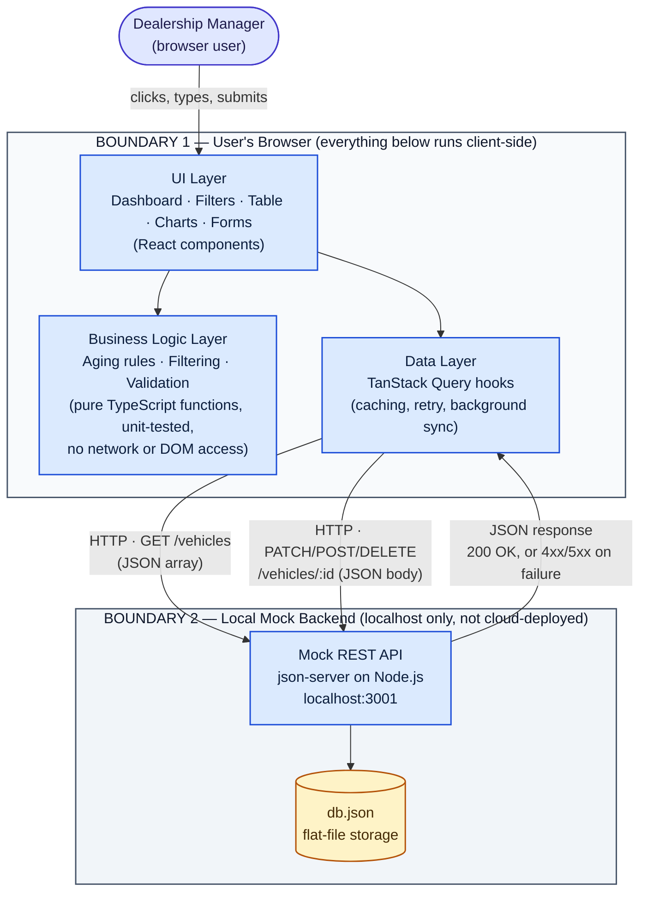

# Intelligent Inventory Dashboard — System Design Document

**Keyloop Technical Assessment — Scenario B (Supply)**

## Overview

Dealership managers currently have no easy way to notice which vehicles have been sitting in inventory too long — it comes down to memory or manual spot checks. This project is a web dashboard that solves that: it gives a manager automatic visibility into aging stock, and a simple way to record what they plan to do about it.

The assessment allows building either the backend or the frontend in full, with the other layer mocked. This project implements the **frontend in full**. The "mock" backend, however, isn't a throwaway stand-in — it's a real, working REST API (json-server) that saves data to a file on disk. That distinction matters directly: one of the three requirements is that a manager's logged action must actually persist, not just appear to work until the page refreshes.

The dashboard covers three things: a filterable view of the full vehicle inventory, automatic identification of aging stock, and a way for a manager to log and update an action plan for each aging vehicle.

---

## Scope & Assumptions

A few points in the brief were open to interpretation. Here's how each was resolved:

- **"Aging stock" (over 90 days)** is calculated live from each vehicle's intake date, not stored as a fixed value — a vehicle at exactly 90 days does not count as aging. A second tier, **critical** (over 150 days), was added so the most urgent vehicles don't get lost in a single undifferentiated "aging" bucket.
- **Logging an action** uses a fixed list of status options (so progress can be tracked consistently — e.g. "Price Reduction Planned") plus an optional free-text note for extra context.
- **No login and no multi-location support.** The tool assumes a single dealership and one implicit manager user, consistent with the assessment's scope.
- **A few capabilities beyond the three core requirements were added deliberately:** pagination, a suggested next action for vehicles that haven't been reviewed yet (a simple rule-based hint, explicitly not machine learning), and the ability to add or remove a vehicle from inventory. Each was a considered, scoped addition rather than an assumption forced by an ambiguous requirement — noted here in the interest of being upfront about what was and wasn't asked for.

---

## Architecture

**Legend:** blue boxes are application components/modules; the yellow cylinder is a data store; the light-gray outer boxes are trust/deployment boundaries — everything inside "Boundary 1" runs in the manager's own browser tab with no server-side code at all, and everything inside "Boundary 2" is a local process on the same machine, not a real hosted service.

**Reading the diagram:**

- **System boundaries.** There are exactly two: the browser (the entire real application) and the local mock backend (a stand-in for a future real API). Nothing here is deployed to any cloud provider — that's a deliberate scope choice explained below, not an oversight.
- **Components.** Three layers on the client side, each with one job — UI (what's on screen), Business Logic (the rules, isolated so they can be tested without a screen at all), and the Data Layer (talks to the backend, caches results). One component on the server side — the mock API itself — backed by one file for storage.
- **Interactions.** Every arrow is labeled with what actually crosses it: a click or keystroke from the manager, a `GET` to fetch the vehicle list, a `PATCH`/`POST`/`DELETE` to change one, and the JSON response that comes back (including what an error looks like).
- **Protocols & technologies.** Communication between the app and the mock backend is plain HTTP with a REST-style contract (one URL per vehicle, one verb per action) and JSON bodies — deliberately simple so a real backend could implement the identical contract later with no frontend changes.

**Infrastructure, security, and scalability — addressed honestly for this project's actual scope:**

This is a local, single-user assessment build with a mocked backend, not a deployed product, so several categories a production system diagram would normally show don't apply *yet* — rather than omit them silently, here's what's genuinely in place versus what a real deployment would need:

| Concern | Current state | What a production version would add |
|---|---|---|
| **Deployment / infrastructure** | Runs entirely on localhost — the browser tab and the mock API are both processes on the same machine, not hosted anywhere. | The React app would deploy as static files behind a CDN; the API would move to a real hosted service (e.g. a managed database + an API layer) with its own environment. |
| **Security / authentication** | None — there's a single implicit manager user and no login, matching the brief's stated scope. | User authentication and session handling, HTTPS in transit, and role-based access if more than one manager or location were involved. |
| **Scalability / redundancy** | A single Node process serving a flat file; not built to handle concurrent writes from multiple users. | A real database with proper concurrency handling, and — only if traffic actually warranted it — load balancing across multiple API instances. |
| **Error handling & recovery** | Already implemented: a failed fetch shows a retry button instead of a blank screen; a failed save keeps the manager's entered data on screen with an inline error instead of losing it; an unexpected crash anywhere in the interface shows a fallback screen with a reload option, not a blank page. | Centralized error tracking (e.g. Sentry) and server-side retry/queueing for failed writes. |

The point of this table is to be explicit about what's real versus what's a known, deliberate boundary of this assessment's scope — not to leave the reader guessing whether security or scaling were simply forgotten.

---

## Component Roles

| Part | What it does |
|---|---|
| **Dashboard stats** | Four numbers at a glance: total vehicles, how many are aging, average time in stock, and total inventory value. |
| **Aging stock banner** | An always-visible alert showing how many vehicles need attention, with a shortcut to filter straight to them. |
| **Filters** | Narrows the list by make, model, year, VIN, or a range of days in stock. |
| **Vehicle table** | The main list, paginated for readability. Each row can expand to show more detail (VIN, color, mileage, intake date) or to remove that vehicle. Severity is shown with a badge, not color alone, so it reads correctly regardless of colorblindness. |
| **Insights charts** | Three visuals: an aging-severity breakdown, which makes have the most aging stock, and how the whole inventory is spread across different lengths of time in stock. |
| **Log/Update Action** | A slide-out form for recording a manager's plan for an aging vehicle. It suggests a likely next step for anything not yet reviewed, clearly labeled as a suggestion — never presented as if it were the manager's own past decision. |
| **Add Vehicle** | A form for adding a new vehicle, with real validation — for example, a VIN has to be a genuine, unique 17-character code. Every problem with the form is shown at once, not one at a time. |
| **Remove Vehicle** | Asks for confirmation before deleting, since it can't be undone. |
| **Business rules** | Independent, tested functions answering things like "how many days has this vehicle been in stock?" or "does this vehicle match the current filters?" — kept separate from the screen so each one can be tested directly. |
| **Data layer** | Handles all communication with the mock backend: fetching, caching, and refreshing the screen after any change. |
| **Mock backend** | A real REST API, not a static fixture — stores data in a file so changes survive a refresh or a restart. |

---

## Data Flow

1. On load, the dashboard asks the mock backend for the full vehicle list.
2. Each vehicle's "days in stock" is calculated from its intake date at that moment — never pre-stored, so it's always current.
3. Filters and pagination narrow what's displayed without changing the underlying data.
4. When a manager logs or updates an action, the app sends that change to the mock backend, which saves it to disk; the screen then refreshes to show the new status.
5. Adding or removing a vehicle works the same way: a request is sent, the backend saves the change, and the screen updates to match.
6. Before a new vehicle is saved, its details are checked — required fields, a sane year, a valid and unique VIN, a non-future intake date. Any problems are shown immediately, and nothing is sent until they're fixed.
7. Removing a vehicle always asks for confirmation first.

---

## Technology Choices

| Choice | Why |
|---|---|
| **React + Vite + TypeScript** | A fast, modern setup. TypeScript catches data-shape mistakes early — useful here since one record (a vehicle) flows through almost every part of the app. |
| **Tailwind CSS + a custom visual design system** | Keeps styling consistent without hand-writing CSS for every element. Design tokens (colors, spacing, corner rounding) are defined once and reused everywhere, rather than repeated per component, so a style change in one place takes effect app-wide. |
| **TanStack Query** | A data-fetching library that handles caching and keeps the screen in sync automatically after any change, rather than writing that logic by hand. It also means swapping the mock backend for a real one later would only touch this one layer, not the whole app. |
| **json-server (mock backend)** | A real REST API with almost no setup — chosen specifically because a manager's action needs to genuinely persist, not just appear to. |
| **Recharts** | A well-supported charting library for the insights panel, used instead of building charts from scratch. |
| **A self-hosted web font (Inter, via Fontsource)** | Matches the design system's typography without depending on an external font service at runtime. |
| **Vitest + React Testing Library** | Pairs natively with the rest of the setup; used for writing and running the test suite. |

---

## Observability Strategy

There's no real backend to monitor here, so observability focuses on what's visible when something goes wrong, and on a consistent record of what happened:

- Key events are logged with a timestamp — inventory loading successfully or failing, and a manager's action succeeding or failing (logging a status change, adding a vehicle, or removing one). Only the status-logging events currently record which vehicle was involved; add/remove events don't yet carry a vehicle reference, since they share a single generic success/failure log handler that was originally written just for status updates.
- If the mock backend is unreachable, the screen shows a clear error message with a retry option, not a blank page.
- A small "Syncing…" indicator appears during background updates (like after saving an action), so a manager isn't left wondering whether something happened.
- If any part of the interface crashes unexpectedly, a fallback screen appears with a reload option, instead of a blank one.

A production version connected to a real backend would add: centralized error tracking (e.g. Sentry), usage analytics, and server-side logging with request tracing.

---

## GenAI Use in the Design Phase

Design decisions for this project were made in conversation with Claude, used specifically as a thinking partner rather than a code generator. For every decision with more than one reasonable answer — how the mock backend should behave, what logging an action should look like, how filtering should work — Claude laid out the real trade-offs of each option, and a decision was made and recorded before any code was written.

Once a decision was locked in, it became a small, specific instruction for Claude Code (the tool that wrote the actual implementation), one focused step at a time, so each piece could be checked before the next one began. This document was written the same way: built up alongside the project, not reconstructed afterward.

### Workflow structure

Four separate conversations were kept open throughout the project, each scoped to a single role rather than one general-purpose chat handling everything:

| Role | Responsibility |
|---|---|
| **Brainstorming** | Open-ended exploration of options before a decision was needed. |
| **Prompt drafting / spec partner** | Turning a locked-in decision into a single, precisely scoped prompt for the builder — explicitly instructed not to write code itself, and to push back if a request was too broad or underspecified. |
| **Debugging** | Diagnosing issues by reading actual source files directly, rather than guessing and re-prompting the builder blind. |
| **Claude Code (builder)** | Implementation only — never made an architectural or design decision on its own; every decision it executed had already been made in one of the other three chats. |

Separating these roles kept each conversation's context focused on one kind of work, and kept the builder from ever being in a position to make a scope decision by default.

### Staged, scoped prompting

The build started from a thirteen-stage plan (scaffold → mock data/API → business logic and tests → one UI section at a time → observability → polish → documentation), locked in during the very first setup prompt — but that was the starting plan, not the final scope. Once the three core requirements were solid, one-scoped-prompt-at-a-time approach continued for capabilities added deliberately beyond the original plan: pagination, the insights charts, the recommended-action heuristic, and the Add/Remove Vehicle flow. Every prompt, original plan or later addition, specified exact data shapes up front so they couldn't drift between stages.

### Guardrails against scope drift

This staged structure was tested directly, not just assumed to work, on two separate occasions where the natural next step would have been to go outside the assessment's actual scope:

- **A hard-to-diagnose bug prompted an impulse to discard working code.** After extended, unsuccessful debugging, the instinct was to rewrite broad areas of the codebase that might be related. The planning-partner chat identified this as the same "too broad, underspecified" pattern it was explicitly instructed to catch, and redirected toward reading the actual source files directly instead — which located the real cause (a build-tool file-watcher conflict, detailed in the README) within minutes, with no rewrite needed.
- **UI polish began to exceed what the evaluation criteria actually covered.** After several rounds of visual refinement on a single component, the planning-partner chat flagged that continuing would trade further, ungraded polish for time that could go toward the deliverables actually being scored, and recommended moving forward instead.

In both cases, the guardrail worked because the scope and evaluation criteria had been stated explicitly up front, giving the AI something concrete to check new requests against — rather than relying on it to infer scope on its own.

### Visual design tooling

Alongside Claude, **Google Stitch** (Google's AI-assisted UI design tool) was used during the design phase to explore layout and visual-direction options before any component was implemented. Its output informed the custom design-token system (`DESIGN.md`) that Claude Code later implemented consistently across every component, rather than each screen being styled ad hoc.

---

## Appendix: Vehicle Data Model

| Field | Holds |
|---|---|
| id | A unique identifier assigned by the mock backend. Always a **string**, not a number — the mock backend assigns a random string id to any vehicle created through the app, so ids can't be treated as numeric even though the seed data's ids happen to look like plain integers. |
| make, model, year, trim, color | Basic identifying details |
| vin | A unique, 17-character identifier |
| price, mileage | Numeric details |
| intakeDate | When the vehicle entered inventory — the basis for its "days in stock" |
| actionStatus, actionNote | The manager's logged plan for this vehicle, if any |
| actionUpdatedAt | When that plan was last logged or updated, set automatically at save time |