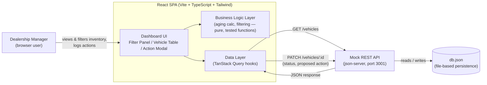

# System Design Document — Intelligent Inventory Dashboard

**Keyloop Technical Assessment — Scenario B (Domain: Supply)**

> **Status:** Living document. Updated as each build stage completes.
> **Current stage:** Stage 6 complete (action-logging UI + persistence) → all three core requirements implemented. Starting observability hooks / polish.
> Sections marked `TBD` will be filled in as those decisions are made — see Section 10 for the live tracker.

---

## 1. Overview

Dealership managers currently have no fast way to see which vehicles have been
sitting in inventory too long, or to record what they're doing about it. This
project gives them a single dashboard to:

1. View and filter the full vehicle inventory (make, model, age).
2. Immediately see which vehicles count as **aging stock** (>90 days in inventory),
   with a second tier — **critical** (>150 days) — so the most urgent vehicles
   don't get lost in a single undifferentiated "aging" bucket.
3. Log and persist a status / proposed action against each aging vehicle
   (e.g. "Price Reduction Planned").

**Scope decision:** per the assessment's "choose one layer" instruction, this
project implements the **frontend fully** and **mocks the backend**. The mock
backend is not a throwaway stub — it's a real REST API (json-server) with
file-based persistence, chosen specifically so that requirement 3 (persisting
a manager's action) behaves like a real write, not a local-only illusion.

---

## 2. Architecture Diagram

**Why this diagram is shaped this way:** one direction of flow (left to right),
one box per real responsibility, and labels on every arrow stating exactly
what crosses that boundary. Nothing here is decorative — every box is
something that will exist in the repo.

---

## 3. Component Roles

| Component | Role |
|---|---|
| **Dashboard UI** | Renders the filter panel, vehicle table, and the action-logging modal/drawer. Presentation only — no business logic lives here. |
| **Business Logic Layer** | Pure functions: computing "days in inventory" from an intake date, determining aging-stock status (>90 days), applying make/model/age filters. Deliberately isolated from React components so it can be unit-tested directly (this is the "core business logic" the brief asks the test suite to cover). |
| **Data Layer (TanStack Query)** | Owns all communication with the mock API: fetching, caching, invalidation after a write, loading/error state. Chosen so the frontend already behaves like it's talking to a real backend with real latency and failure modes. |
| **Mock REST API (json-server)** | Stands in for a real backend. Serves `GET /vehicles`, accepts `PATCH /vehicles/:id` to persist a status/action. Its contract is intentionally simple enough that a real backend could implement the same routes with no frontend changes. |
| **db.json** | Flat-file persistence so state survives a page refresh *and* a server restart — standing in for a real database. `vite.config.ts` explicitly excludes `mock-server/**` from Vite's own dev-server file watcher (`server.watch.ignored`) — see the Revision Log entry below for why this is load-bearing, not cosmetic. |

### Vehicle Data Model

Finalized in Stage 2 (`src/types/vehicle.ts`). One flat `Vehicle` record per row in `db.json`, matching json-server's REST-per-resource convention:

| Field | Type | Notes |
|---|---|---|
| `id` | `number` | json-server resource id. **Note (found in Stage 6):** json-server v1 serves `id` as a *string* in every JSON response even though `db.json` stores it as a number — the API client (`src/api/vehicles.ts`) coerces it back to `Number(...)` on both `getVehicles()` and `updateVehicleAction()` so this type is actually honored, not just declared. |
| `vin` | `string` | 17-char alphanumeric, unique |
| `make`, `model`, `year`, `trim`, `color` | `string` / `number` | descriptive fields |
| `price`, `mileage` | `number` | |
| `intakeDate` | `string` | ISO date (`YYYY-MM-DD`), no time component — the field the aging-stock calculation (Stage 3) will diff against "today" |
| `actionStatus` | `ActionStatus \| null` | one of a closed 6-value enum (`ACTION_STATUS_OPTIONS`): Price Reduction Planned, Marketing Push, Transfer to Another Location, Send to Auction, Manager Reviewing, No Action Needed. `null` until a manager logs an action. |
| `actionNote` | `string \| null` | optional free-text, only meaningful once `actionStatus` is set |
| `actionUpdatedAt` | `string \| null` | ISO datetime, set by the API client on every `PATCH`, not by the caller |

API contract (json-server): `GET /vehicles` returns the full array; `PATCH /vehicles/:id` accepts `{ actionStatus, actionNote?, actionUpdatedAt }` and returns the updated record. The frontend never computes `actionUpdatedAt` outside the API client — `updateVehicleAction()` stamps `new Date().toISOString()` on every call so the timestamp can't drift from the actual write.

The mock API's base URL is externalized via `VITE_API_BASE_URL` (`.env.example`, defaults to `http://localhost:3001` if unset) rather than hardcoded, so pointing the frontend at a real backend later is a config change, not a code change — consistent with the "backend evolution path" in Section 8.

### Business Logic Layer — Implementation

Finalized across Stages 3 and 5 (`src/lib/inventoryLogic.ts`), fully unit-tested (`src/lib/inventoryLogic.test.ts`, 32 cases), zero React/DOM dependencies:

| Function | Purpose |
|---|---|
| `getDaysInInventory(intakeDate, asOfDate?)` | Whole-day difference between `asOfDate` (defaults to `new Date()`) and `intakeDate`. Can return negative values for a future intake date. |
| `isAgingStock(daysInInventory)` | `true` only when strictly greater than `AGING_STOCK_THRESHOLD_DAYS` (90) — exactly 90 is **not** aging. |
| `getAgingSeverity(daysInInventory)` | *(Stage 5)* Three-tier read on the same day count: `"none"` (≤90), `"aging"` (91–150), `"critical"` (>`CRITICAL_STOCK_THRESHOLD_DAYS`, 150). Never throws on negative input — returns `"none"`. |
| `filterVehicles(vehicles, filters, asOfDate?)` | AND-combines optional `make`/`model` (case-insensitive exact match; empty string treated as no filter) and `minDays`/`maxDays` (inclusive range against `getDaysInInventory`). Non-mutating. |
| `getAgingVehicles(vehicles, asOfDate?)` | Vehicles where `isAgingStock` is true. Non-mutating. |

**Date-math convention (important, and distinct from the seed-data convention in Section 7):** `getDaysInInventory` anchors *both* `intakeDate` and `asOfDate` to **UTC midnight calendar dates**, using `asOfDate`'s `getUTC*()` components. This is deliberately different from the local-calendar-day fix applied to the Stage 2 seed-data script — here it's the right choice for the opposite reason. The seed-data script computed "today" from the *host machine's wall clock* with no explicit reference point, so local-time semantics were correct (a person's "today" is local). `getDaysInInventory` instead takes `asOfDate` as an explicit parameter — as a pure function, its output must depend only on that input, not on the timezone of whichever machine happens to run it. Anchoring both operands to UTC makes the function's result identical everywhere it runs, which is what "pure" and "unit-testable" require. Every real caller (`AgingStockSummary`, `VehicleTable`, as of Stage 5) uses the default `asOfDate` (`new Date()`); the function itself makes no wall-clock assumptions beyond that default.

### Dashboard UI — Implementation

Finalized across Stages 4–6 (`src/components/FilterPanel.tsx`, `src/components/VehicleTable.tsx`, `src/components/AgingStockSummary.tsx`, `src/components/ActionLogDrawer.tsx`), wired into `App.tsx`. As of Stage 6, all three core requirements from Section 1 are covered: inventory visualization, prominent aging-stock display, and action logging. No sorting or pagination yet.

- **`FilterPanel`** — presentational, controlled by `App`'s `filters` state. Make/model options are derived from the fetched vehicle data (not hardcoded), so the dropdowns always reflect what's actually in inventory. Selecting "All" sets that field back to `undefined` (not `""`) to keep `VehicleFilters` state canonical, even though `filterVehicles` itself tolerates either. The two day-count inputs parse an empty field to `undefined` (never `0` or `NaN`) so an unset bound doesn't silently become a real filter value of zero.
- **`VehicleTable`** — presentational; receives an already-filtered list and does no filtering itself. Row expansion is tracked as a `Set<number>` of vehicle ids in local component state, independent of the `filters` state — so expanding a row and then changing or resetting filters does **not** collapse it. This wasn't explicitly specified; it's a deliberate reading of "multiple rows can be expanded independently" as *independent of filtering*, not just independent of each other. Each row also computes `getAgingSeverity` and gets a background tint (amber for aging, red for critical) plus a text badge ("Aging"/"Critical") in a dedicated Status column — the badge exists specifically so severity isn't conveyed by color alone. *(Stage 6)* A separate Action column shows the current `actionStatus` (or "Not yet reviewed") plus a "Log Action"/"Update Action" button, but **only** for rows with `severity !== "none"` — the column is intentionally non-functional for healthy stock, per Requirement 3's framing as an aging-stock workflow, not a general-purpose editor. The button's click handler calls `event.stopPropagation()` (via the cell, not just the button) so clicking it doesn't also trigger the row's expand/collapse toggle.
- **`AgingStockSummary`** — the dashboard's headline element, rendered above the filter panel. Receives the **full, unfiltered** vehicle list (not `filteredVehicles`), so it always reflects true inventory state regardless of what the user has filtered the table down to. Shows total/aging/critical counts, or a distinct green "no aging stock" state when the count is zero (never a bare "0"). Its "View aging stock" button sets `filters.minDays` to `AGING_STOCK_THRESHOLD_DAYS + 1` (91) while spreading the existing `filters` object, so it composes with whatever make/model/maxDays the user already had set rather than clobbering them.
- **`ActionLogDrawer`** *(Stage 6)* — a right-side drawer over a semi-transparent backdrop; either control closes it without saving. Internally split into an outer `ActionLogDrawer` (handles the `vehicle === null` case) and an inner `ActionLogDrawerForm` **keyed on `vehicle.id`**. Keying on id — rather than syncing local state to prop changes with a `useEffect` — means React remounts the form fresh whenever a different vehicle opens: local `selectedStatus`/`noteText` initialize straight from that vehicle's current values with no risk of stale data leaking across vehicles, and the mutation hook (`useUpdateVehicleAction`) also remounts fresh, so a failed save on one vehicle can never show its error message on the next vehicle opened. Calls the *existing* `useUpdateVehicleAction` hook from Stage 2 unchanged, with exactly the payload shape it already expected (`{ id, actionStatus, actionNote? }`) — no hook redesign. `actionNote` is sent as `null`, never `""`, when the textarea is empty, matching the `Vehicle` type's null convention. On success the drawer closes (`onClose()`, called as `mutate`'s per-call callback alongside the hook's existing `invalidateQueries`); on error, the drawer stays open with the entered values intact and shows the error inline — no global toast system.
- **Date display bug avoided:** the same class of UTC-vs-local timezone bug hit twice already (Stage 2's seed script, and the reasoning documented above for `getDaysInInventory`) applies a third time here. `new Date(vehicle.intakeDate).toLocaleDateString()` would silently shift the displayed intake date backward by a day in timezones behind UTC, because `toLocaleDateString()` converts to the *browser's* local timezone by default. Fixed by passing `{ timeZone: 'UTC' }` to `toLocaleDateString`, so the displayed date always matches the stored `YYYY-MM-DD` value regardless of the viewer's timezone.

---

## 4. Data Flow

1. On load, the Dashboard UI triggers a `GET /vehicles` request via the Data Layer.
2. The response is cached client-side; UI components subscribe to it.
3. The Business Logic Layer computes each vehicle's days-in-inventory from its
   intake date and flags any vehicle over 90 days as **aging stock**.
4. The Filter Panel narrows the visible list; filtering is pure-function logic,
   independently unit-tested, not scattered through JSX.
5. The manager selects an aging vehicle, opens the action modal, and submits
   a status/proposed action.
6. The Data Layer sends `PATCH /vehicles/:id` with the new fields.
7. json-server persists the change to `db.json` and returns the updated record.
8. The Data Layer invalidates/refetches (or applies an optimistic update) so
   the UI reflects the change immediately, without a full page reload.

---

## 5. Tech Stack & Justification

| Choice | Justification |
|---|---|
| **React + Vite + TypeScript** | Fast dev loop; type safety matters here because the whole app is built around one data shape (the vehicle record) flowing through filters, aging logic, and a persisted status — types catch shape mismatches early. |
| **Tailwind CSS** | Utility-first keeps effort on data clarity (the actual evaluation criterion) rather than hand-rolled CSS. |
| **TanStack Query** | Gives the mock integration real caching/invalidation semantics instead of ad-hoc `useEffect` + `fetch`. This mirrors the sync/cache patterns from data-pipeline work, and means the eventual swap from json-server to a real API is a data-layer change, not a rewrite. |
| **json-server** | Closest mock-backend option to a real REST contract for near-zero setup cost; satisfies the requirement that a manager's action must actually *persist*, not just live in component state. |
| **Vitest + React Testing Library** | Native pairing with Vite; tests sit next to the source they cover. |

This scenario also maps directly onto real experience: dashboarding for
decision-making (Power BI/Tableau background) and the underlying problem
itself — stock aging and action tracking — mirrors day-to-day inventory
operations work.

---

## 6. Observability Strategy

**Draft — flag if you want a different balance here.**

What's actually implemented (lightweight, but real, given this is a frontend-only build):

- A small structured logging utility (info/warn/error) around key events:
  fetch success/failure, filter changes, status-update submissions.
- Fetch/mutation state surfaced *in the UI itself* (not just the console) —
  loading indicators, an error banner/toast if the mock API call fails,
  sourced directly from TanStack Query's status flags.
- An error boundary around the dashboard so a render failure degrades
  gracefully instead of blanking the screen.

What a production version would add (documented here, not built, since it's
out of scope for a mocked backend):

- Centralized frontend error tracking (e.g. Sentry).
- Product analytics on filter usage and time-to-action on aging stock.
- Backend-side request logging/tracing with correlation IDs once json-server
  is replaced by a real API.
- API health checks / uptime monitoring.

---

## 7. Assumptions & Ambiguity Resolutions

*(Per the brief's instruction to document assumptions where requirements are ambiguous.)*

- **Layer choice:** frontend implemented fully; backend mocked via json-server.
- **"Aging stock" threshold:** strictly >90 days in inventory (exactly 90 does not count), computed from `Vehicle.intakeDate` via `getDaysInInventory` (finalized in Stage 3 — see Section 3, Business Logic Layer — Implementation). Day counts anchor both `intakeDate` and `asOfDate` to **UTC midnight**, not the local calendar day — see that subsection for why (the function takes `asOfDate` as an explicit parameter, so its result must not depend on the host machine's timezone). This is a narrower, related fix to the one below: the Stage 2 seed-data script had no explicit "as of" input — it computed real wall-clock "today," where *local* time is the correct frame — so the two decisions use opposite conventions for good reason, not by accident.
- **"Persist a status"** interpreted as: survives a page refresh *and* a server restart — hence json-server with file persistence, not in-memory-only state.
- **No authentication / multi-user concerns modeled** — a single implicit "manager" user, consistent with the brief's scope.
- **No client-side router** — single dashboard view; action logging happens in a modal/drawer rather than a separate route.
- **Package manager:** npm. **Styling:** Tailwind CSS. **Testing:** Vitest + React Testing Library.

---

## 8. Future Considerations ("Build for the Future")

Scoped to the frontend, since that's the fully-implemented layer:

- **Scaling the list:** current implementation targets realistic dealership-scale
  data (tens to low hundreds of vehicles) without virtualization. If inventory
  counts grew much larger, list virtualization (e.g. `react-window`) would be
  the next step — noted here as a known, deliberate boundary rather than an
  oversight.
- **Performance:** aging/filtering computations are memoized so they don't
  re-run on unrelated re-renders.
- **Reliability:** mock API downtime/errors are handled as visible UI states
  (not silent failures), so the pattern already matches how a real API outage
  would need to be handled.
- **Maintainability:** business logic (aging calculation, filtering) is
  isolated in pure, tested functions, separate from UI components — swapping
  the mock backend for a real one only touches the data layer.
- **Backend evolution path:** json-server's REST contract (`GET`/`PATCH` on
  `/vehicles`) is designed as a drop-in stand-in; a real backend implementing
  the same contract requires no frontend changes.

---

## 9. GenAI Use in the Design Phase

*(Draft — will tighten wording once the full project narrative is in for the video.)*

Design decisions for this project were made in a dedicated chat with Claude,
used deliberately as a **spec-and-decision partner rather than a code
generator** — its explicit role was to surface trade-offs *before* anything
was handed to an implementation agent, not to write the app itself.

Process:

- For every decision with more than one reasonable answer (mock-backend
  shape, styling approach, state-management library), Claude presented the
  concrete trade-offs of each option rather than picking one silently.
- I made the call on each; decisions were logged immediately (Section 7 of
  this document, plus commit history) rather than reconstructed afterward.
- Once a decision was locked, Claude turned it into a single, narrowly-scoped
  prompt for Claude Code — deliberately small enough that I could verify the
  output before the next stage began, rather than one large prompt covering
  multiple concerns at once.
- This document itself was produced the same way: drafted stage-by-stage
  alongside the build, not written retroactively after the code existed.

---

## 10. Status Tracker

- [x] Scaffold (Vite + TS + Tailwind + json-server + Vitest) — complete, verified
- [x] Stage 2: vehicle data model + seed data + data layer (types, API client, React Query) — complete, verified
- [x] Stage 3: aging-stock business logic + unit tests — complete, verified (24 tests)
- [x] Stage 4: inventory table + filter UI (Requirement 1) — complete, verified (FilterPanel + VehicleTable, wired into App)
- [x] Stage 5: prominent aging-stock display (Requirement 2) — complete, verified (AgingStockSummary + severity treatment in VehicleTable, 32 tests total)
- [x] Stage 6: action-logging UI + persistence (Requirement 3) — complete, verified (ActionLogDrawer, Action column, end-to-end PATCH verified against live mock API)
- [ ] Observability hooks implementation
- [ ] Final polish / accessibility pass
- [ ] Video recording

## Revision Log

| Date | Section | Change | Reason |
|------|---------|--------|--------|
| 2026-07-09 | Observability | Scoped to console logging + UI error/loading states + error boundary | Kept it demo-appropriate; Sentry/analytics/tracing deferred to a "production roadmap" note |
| 2026-07-09 | 3 (Component Roles) | Added concrete Vehicle Data Model subsection: finalized field list, the 6-value `ActionStatus` enum, and the `GET`/`PATCH` API contract | Was previously deferred to Stage 2; now implemented in `src/types/vehicle.ts` and `src/api/vehicles.ts` |
| 2026-07-09 | 3 (Component Roles) | API base URL externalized via `VITE_API_BASE_URL` env var (`.env.example`, defaults to `http://localhost:3001`) instead of hardcoded | Makes swapping the mock API for a real backend a config change, matching the Section 8 backend-evolution intent |
| 2026-07-09 | 7 (Assumptions) | Finalized aging-threshold field as `intakeDate`; specified local calendar-day comparison (not UTC) as the required convention | Seed-data script initially computed dates via `toISOString()`, which shifted by a day near a UTC midnight rollover during EDT evening hours — fixed by switching to local-date arithmetic; Stage 3's aging calc must follow the same convention or the bug resurfaces |
| 2026-07-10 | 3 (Component Roles) | Added Business Logic Layer — Implementation subsection: the four `inventoryLogic.ts` functions, and the UTC-midnight date-anchoring convention actually used | Finalizes what was `TBD` since Section 1; implemented in `src/lib/inventoryLogic.ts`, covered by 24 unit tests in `src/lib/inventoryLogic.test.ts` |
| 2026-07-10 | 7 (Assumptions) | Corrected the aging-threshold entry: `getDaysInInventory` uses **UTC-midnight** date anchoring, not the local-calendar-day convention the 2026-07-09 entry said Stage 3 "must follow" | The earlier note conflated two different problems. Local time is correct for the Stage 2 script (computing real wall-clock "today" with no explicit input). UTC is correct for `getDaysInInventory` (a pure function whose output must depend only on its explicit `asOfDate` argument, not the timezone of whatever machine runs it) — both conventions are deliberate, not contradictory, but the doc needed to say so explicitly |
| 2026-07-10 | 3 (Component Roles) | Added Dashboard UI — Implementation subsection: `FilterPanel`/`VehicleTable` behavior, row-expansion-survives-filter-changes decision, and the UTC-safe intake-date display fix | Finalizes what Section 3's Dashboard UI row described only abstractly; implemented in `src/components/FilterPanel.tsx` and `src/components/VehicleTable.tsx` |
| 2026-07-10 | 1 (Overview), 3, 10 (Status Tracker) | Introduced a second aging tier, **critical** (>150 days, `CRITICAL_STOCK_THRESHOLD_DAYS`), via `getAgingSeverity`; renumbered the tracker to insert a dedicated Stage 5 (aging-stock display, Requirement 2) and pushed action-logging to Stage 6 | The scaffold-era Stage 5 label ("action-logging UI + persistence") never accounted for a standalone aging-display stage — Requirement 2 needed its own stage once it was actually scoped, so the tracker was renumbered to match the real build order rather than left stale |
| 2026-07-10 | 3 (Component Roles) | Added `AgingStockSummary` to the Dashboard UI Implementation subsection: receives the full unfiltered vehicle list (not the filtered one passed to `VehicleTable`), so the summary always reflects true inventory state; `getAgingSeverity` badges added to `VehicleTable` rows (never color-only) | Implements Requirement 2 (prominent aging-stock display) in `src/components/AgingStockSummary.tsx`; verified end-to-end against the live mock API — 26 vehicles / 9 aging / 6 critical / 15 total aging-stock, matching an independently computed reference count |
| 2026-07-10 | 3 (Vehicle Data Model) | **Bug found and fixed:** json-server v1 serves `id` as a string in every response even though `db.json` stores it as a number — the `Vehicle.id: number` contract was being silently violated. `getVehicles()` and `updateVehicleAction()` in `src/api/vehicles.ts` now coerce it with `Number(...)` | Found while verifying Stage 6's action-logging flow end-to-end against the live mock API, not something Stage 2's original verification (which only checked response shape/count, not field types) caught. Latent since Stage 2; hadn't caused a visible bug yet only because no code compared `vehicle.id` with strict `===` against a real number, but would have broken silently the moment something did |
| 2026-07-10 | 3 (Component Roles), 10 (Status Tracker) | Added `ActionLogDrawer` to the Dashboard UI Implementation subsection; Stage 6 (action-logging UI + persistence, Requirement 3) marked complete — all three core requirements now implemented | Implements the last of the three core requirements in `src/components/ActionLogDrawer.tsx`, reusing the existing `useUpdateVehicleAction` hook's payload shape unchanged (per instruction, inspected before writing any code); verified end-to-end against the live mock API — opened an unreviewed aging vehicle, submitted a status + note, confirmed the PATCH persisted and the table reflected it after refetch, and confirmed both the backdrop and the X control close without saving |
| 2026-07-10 | 3 (db.json row) | **Bug found and fixed:** `vite.config.ts` now sets `server.watch.ignored: ['**/mock-server/**']` | Reported as "filters get cleared after logging/updating an action." React state was never actually the problem — `filters` survived the entire mutation → invalidate → refetch cycle intact in every trace. The real cause: `json-server`'s persistence layer (`lowdb`/`steno`) writes `db.json` *atomically* on every `PATCH` — write to a hidden `.db.json.tmp`, then `rename()` it over `db.json`. Vite's dev server watches the whole project root by default, including `mock-server/`, and reacted to that rename with a full page reload (confirmed via Chrome's own "Navigated to http://localhost:5173/" console line, a clean URL with no query string ruling out a native form-submission bypass, and reproducible with extensions fully disabled). A React state bug and "the whole page silently reloads" look identical from the UI, so this took an extended session to pin down: ruled out (in order) a `setFilters({})` call site, an ancestor remount, an effect syncing off `makes`/`models`, native form submission not being prevented, browser-extension interference, and Vite's WebSocket-reconnect reload path, before empirically testing the exact `steno` write pattern against a live Vite instance and watching its own reload trigger fire. `mock-server/` has no reason to be in Vite's frontend watch scope in the first place — it's read only by the separate `json-server` process — so this exclusion is correct regardless, not a narrow patch for one symptom. |