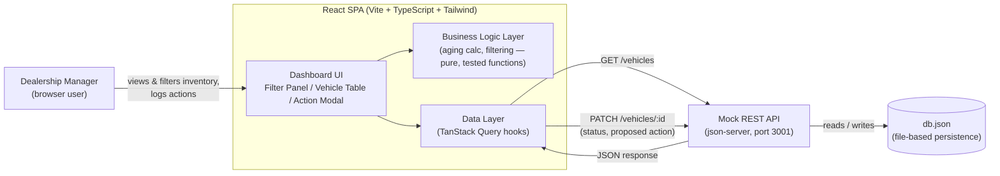

# System Design Document — Intelligent Inventory Dashboard

**Keyloop Technical Assessment — Scenario B (Domain: Supply)**

> **Status:** Living document. Updated as each build stage completes.
> **Current stage:** Stage 2 complete (data layer) → starting Stage 3 (aging-stock business logic).
> Sections marked `TBD` will be filled in as those decisions are made — see Section 10 for the live tracker.

---

## 1. Overview

Dealership managers currently have no fast way to see which vehicles have been
sitting in inventory too long, or to record what they're doing about it. This
project gives them a single dashboard to:

1. View and filter the full vehicle inventory (make, model, age).
2. Immediately see which vehicles count as **aging stock** (>90 days in inventory).
3. Log and persist a status / proposed action against each aging vehicle
   (e.g. "Price Reduction Planned").

**Scope decision:** per the assessment's "choose one layer" instruction, this
project implements the **frontend fully** and **mocks the backend**. The mock
backend is not a throwaway stub — it's a real REST API (json-server) with
file-based persistence, chosen specifically so that requirement 3 (persisting
a manager's action) behaves like a real write, not a local-only illusion.

---

## 2. Architecture Diagram

**Why this diagram is shaped this way:** one direction of flow (left to right),
one box per real responsibility, and labels on every arrow stating exactly
what crosses that boundary. Nothing here is decorative — every box is
something that will exist in the repo.

---

## 3. Component Roles

| Component | Role |
|---|---|
| **Dashboard UI** | Renders the filter panel, vehicle table, and the action-logging modal/drawer. Presentation only — no business logic lives here. |
| **Business Logic Layer** | Pure functions: computing "days in inventory" from an intake date, determining aging-stock status (>90 days), applying make/model/age filters. Deliberately isolated from React components so it can be unit-tested directly (this is the "core business logic" the brief asks the test suite to cover). |
| **Data Layer (TanStack Query)** | Owns all communication with the mock API: fetching, caching, invalidation after a write, loading/error state. Chosen so the frontend already behaves like it's talking to a real backend with real latency and failure modes. |
| **Mock REST API (json-server)** | Stands in for a real backend. Serves `GET /vehicles`, accepts `PATCH /vehicles/:id` to persist a status/action. Its contract is intentionally simple enough that a real backend could implement the same routes with no frontend changes. |
| **db.json** | Flat-file persistence so state survives a page refresh *and* a server restart — standing in for a real database. |

### Vehicle Data Model

Finalized in Stage 2 (`src/types/vehicle.ts`). One flat `Vehicle` record per row in `db.json`, matching json-server's REST-per-resource convention:

| Field | Type | Notes |
|---|---|---|
| `id` | `number` | json-server resource id |
| `vin` | `string` | 17-char alphanumeric, unique |
| `make`, `model`, `year`, `trim`, `color` | `string` / `number` | descriptive fields |
| `price`, `mileage` | `number` | |
| `intakeDate` | `string` | ISO date (`YYYY-MM-DD`), no time component — the field the aging-stock calculation (Stage 3) will diff against "today" |
| `actionStatus` | `ActionStatus \| null` | one of a closed 6-value enum (`ACTION_STATUS_OPTIONS`): Price Reduction Planned, Marketing Push, Transfer to Another Location, Send to Auction, Manager Reviewing, No Action Needed. `null` until a manager logs an action. |
| `actionNote` | `string \| null` | optional free-text, only meaningful once `actionStatus` is set |
| `actionUpdatedAt` | `string \| null` | ISO datetime, set by the API client on every `PATCH`, not by the caller |

API contract (json-server): `GET /vehicles` returns the full array; `PATCH /vehicles/:id` accepts `{ actionStatus, actionNote?, actionUpdatedAt }` and returns the updated record. The frontend never computes `actionUpdatedAt` outside the API client — `updateVehicleAction()` stamps `new Date().toISOString()` on every call so the timestamp can't drift from the actual write.

The mock API's base URL is externalized via `VITE_API_BASE_URL` (`.env.example`, defaults to `http://localhost:3001` if unset) rather than hardcoded, so pointing the frontend at a real backend later is a config change, not a code change — consistent with the "backend evolution path" in Section 8.

---

## 4. Data Flow

1. On load, the Dashboard UI triggers a `GET /vehicles` request via the Data Layer.
2. The response is cached client-side; UI components subscribe to it.
3. The Business Logic Layer computes each vehicle's days-in-inventory from its
   intake date and flags any vehicle over 90 days as **aging stock**.
4. The Filter Panel narrows the visible list; filtering is pure-function logic,
   independently unit-tested, not scattered through JSX.
5. The manager selects an aging vehicle, opens the action modal, and submits
   a status/proposed action.
6. The Data Layer sends `PATCH /vehicles/:id` with the new fields.
7. json-server persists the change to `db.json` and returns the updated record.
8. The Data Layer invalidates/refetches (or applies an optimistic update) so
   the UI reflects the change immediately, without a full page reload.

---

## 5. Tech Stack & Justification

| Choice | Justification |
|---|---|
| **React + Vite + TypeScript** | Fast dev loop; type safety matters here because the whole app is built around one data shape (the vehicle record) flowing through filters, aging logic, and a persisted status — types catch shape mismatches early. |
| **Tailwind CSS** | Utility-first keeps effort on data clarity (the actual evaluation criterion) rather than hand-rolled CSS. |
| **TanStack Query** | Gives the mock integration real caching/invalidation semantics instead of ad-hoc `useEffect` + `fetch`. This mirrors the sync/cache patterns from data-pipeline work, and means the eventual swap from json-server to a real API is a data-layer change, not a rewrite. |
| **json-server** | Closest mock-backend option to a real REST contract for near-zero setup cost; satisfies the requirement that a manager's action must actually *persist*, not just live in component state. |
| **Vitest + React Testing Library** | Native pairing with Vite; tests sit next to the source they cover. |

This scenario also maps directly onto real experience: dashboarding for
decision-making (Power BI/Tableau background) and the underlying problem
itself — stock aging and action tracking — mirrors day-to-day inventory
operations work.

---

## 6. Observability Strategy

**Draft — flag if you want a different balance here.**

What's actually implemented (lightweight, but real, given this is a frontend-only build):

- A small structured logging utility (info/warn/error) around key events:
  fetch success/failure, filter changes, status-update submissions.
- Fetch/mutation state surfaced *in the UI itself* (not just the console) —
  loading indicators, an error banner/toast if the mock API call fails,
  sourced directly from TanStack Query's status flags.
- An error boundary around the dashboard so a render failure degrades
  gracefully instead of blanking the screen.

What a production version would add (documented here, not built, since it's
out of scope for a mocked backend):

- Centralized frontend error tracking (e.g. Sentry).
- Product analytics on filter usage and time-to-action on aging stock.
- Backend-side request logging/tracing with correlation IDs once json-server
  is replaced by a real API.
- API health checks / uptime monitoring.

---

## 7. Assumptions & Ambiguity Resolutions

*(Per the brief's instruction to document assumptions where requirements are ambiguous.)*

- **Layer choice:** frontend implemented fully; backend mocked via json-server.
- **"Aging stock" threshold:** >90 days in inventory, computed from `Vehicle.intakeDate` (finalized in Stage 2 — see Section 3, Vehicle Data Model). Day counts use **local calendar-day** comparison, not raw UTC timestamp subtraction — the latter can shift a vehicle across the 90-day boundary by up to a day depending on the user's timezone offset relative to UTC at the moment of comparison. The Stage 2 seed-data script hit exactly this bug (dates generated via `toISOString()` came out a day off near a UTC midnight rollover) — Stage 3's aging calculation must follow the same local-date convention used to fix it.
- **"Persist a status"** interpreted as: survives a page refresh *and* a server restart — hence json-server with file persistence, not in-memory-only state.
- **No authentication / multi-user concerns modeled** — a single implicit "manager" user, consistent with the brief's scope.
- **No client-side router** — single dashboard view; action logging happens in a modal/drawer rather than a separate route.
- **Package manager:** npm. **Styling:** Tailwind CSS. **Testing:** Vitest + React Testing Library.

---

## 8. Future Considerations ("Build for the Future")

Scoped to the frontend, since that's the fully-implemented layer:

- **Scaling the list:** current implementation targets realistic dealership-scale
  data (tens to low hundreds of vehicles) without virtualization. If inventory
  counts grew much larger, list virtualization (e.g. `react-window`) would be
  the next step — noted here as a known, deliberate boundary rather than an
  oversight.
- **Performance:** aging/filtering computations are memoized so they don't
  re-run on unrelated re-renders.
- **Reliability:** mock API downtime/errors are handled as visible UI states
  (not silent failures), so the pattern already matches how a real API outage
  would need to be handled.
- **Maintainability:** business logic (aging calculation, filtering) is
  isolated in pure, tested functions, separate from UI components — swapping
  the mock backend for a real one only touches the data layer.
- **Backend evolution path:** json-server's REST contract (`GET`/`PATCH` on
  `/vehicles`) is designed as a drop-in stand-in; a real backend implementing
  the same contract requires no frontend changes.

---

## 9. GenAI Use in the Design Phase

*(Draft — will tighten wording once the full project narrative is in for the video.)*

Design decisions for this project were made in a dedicated chat with Claude,
used deliberately as a **spec-and-decision partner rather than a code
generator** — its explicit role was to surface trade-offs *before* anything
was handed to an implementation agent, not to write the app itself.

Process:

- For every decision with more than one reasonable answer (mock-backend
  shape, styling approach, state-management library), Claude presented the
  concrete trade-offs of each option rather than picking one silently.
- I made the call on each; decisions were logged immediately (Section 7 of
  this document, plus commit history) rather than reconstructed afterward.
- Once a decision was locked, Claude turned it into a single, narrowly-scoped
  prompt for Claude Code — deliberately small enough that I could verify the
  output before the next stage began, rather than one large prompt covering
  multiple concerns at once.
- This document itself was produced the same way: drafted stage-by-stage
  alongside the build, not written retroactively after the code existed.

---

## 10. Status Tracker

- [x] Scaffold (Vite + TS + Tailwind + json-server + Vitest) — complete, verified
- [x] Stage 2: vehicle data model + seed data + data layer (types, API client, React Query) — complete, verified
- [ ] Stage 3: aging-stock business logic + unit tests
- [ ] Stage 4: filter UI
- [ ] Stage 5: action-logging UI + persistence
- [ ] Observability hooks implementation
- [ ] Final polish / accessibility pass
- [ ] Video recording

## Revision Log

| Date | Section | Change | Reason |
|------|---------|--------|--------|
| 2026-07-09 | Observability | Scoped to console logging + UI error/loading states + error boundary | Kept it demo-appropriate; Sentry/analytics/tracing deferred to a "production roadmap" note |
| 2026-07-09 | 3 (Component Roles) | Added concrete Vehicle Data Model subsection: finalized field list, the 6-value `ActionStatus` enum, and the `GET`/`PATCH` API contract | Was previously deferred to Stage 2; now implemented in `src/types/vehicle.ts` and `src/api/vehicles.ts` |
| 2026-07-09 | 3 (Component Roles) | API base URL externalized via `VITE_API_BASE_URL` env var (`.env.example`, defaults to `http://localhost:3001`) instead of hardcoded | Makes swapping the mock API for a real backend a config change, matching the Section 8 backend-evolution intent |
| 2026-07-09 | 7 (Assumptions) | Finalized aging-threshold field as `intakeDate`; specified local calendar-day comparison (not UTC) as the required convention | Seed-data script initially computed dates via `toISOString()`, which shifted by a day near a UTC midnight rollover during EDT evening hours — fixed by switching to local-date arithmetic; Stage 3's aging calc must follow the same convention or the bug resurfaces |