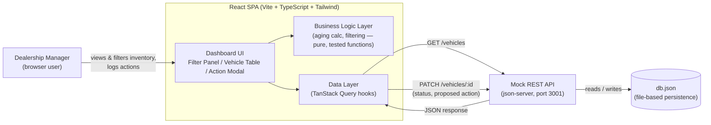

# System Design Document — Intelligent Inventory Dashboard

**Keyloop Technical Assessment — Scenario B (Domain: Supply)**

> **Status:** Living document. Updated as each build stage completes.
> **Current stage:** Stage 10 complete (visual design system applied from `DESIGN.md` across every component) → remaining work is verification in a real browser (several items this stage and Stage 8 explicitly couldn't confirm in this environment) and video recording.
> Sections marked `TBD` will be filled in as those decisions are made — see Section 10 for the live tracker.

---

## 1. Overview

Dealership managers currently have no fast way to see which vehicles have been
sitting in inventory too long, or to record what they're doing about it. This
project gives them a single dashboard to:

1. View and filter the full vehicle inventory (make, model, age).
2. Immediately see which vehicles count as **aging stock** (>90 days in inventory),
   with a second tier — **critical** (>150 days) — so the most urgent vehicles
   don't get lost in a single undifferentiated "aging" bucket.
3. Log and persist a status / proposed action against each aging vehicle
   (e.g. "Price Reduction Planned").

**Scope decision:** per the assessment's "choose one layer" instruction, this
project implements the **frontend fully** and **mocks the backend**. The mock
backend is not a throwaway stub — it's a real REST API (json-server) with
file-based persistence, chosen specifically so that requirement 3 (persisting
a manager's action) behaves like a real write, not a local-only illusion.

---

## 2. Architecture Diagram

**Why this diagram is shaped this way:** one direction of flow (left to right),
one box per real responsibility, and labels on every arrow stating exactly
what crosses that boundary. Nothing here is decorative — every box is
something that will exist in the repo.

---

## 3. Component Roles

| Component | Role |
|---|---|
| **Dashboard UI** | Renders the filter panel, vehicle table, and the action-logging modal/drawer. Presentation only — no business logic lives here. |
| **Business Logic Layer** | Pure functions: computing "days in inventory" from an intake date, determining aging-stock status (>90 days), applying make/model/age filters. Deliberately isolated from React components so it can be unit-tested directly (this is the "core business logic" the brief asks the test suite to cover). |
| **Data Layer (TanStack Query)** | Owns all communication with the mock API: fetching, caching, invalidation after a write, loading/error state. Chosen so the frontend already behaves like it's talking to a real backend with real latency and failure modes. |
| **Mock REST API (json-server)** | Stands in for a real backend. Serves `GET /vehicles`, accepts `PATCH /vehicles/:id` to persist a status/action. Its contract is intentionally simple enough that a real backend could implement the same routes with no frontend changes. |
| **db.json** | Flat-file persistence so state survives a page refresh *and* a server restart — standing in for a real database. `vite.config.ts` explicitly excludes `mock-server/**` from Vite's own dev-server file watcher (`server.watch.ignored`) — see the Revision Log entry below for why this is load-bearing, not cosmetic. |

### Vehicle Data Model

Finalized in Stage 2 (`src/types/vehicle.ts`). One flat `Vehicle` record per row in `db.json`, matching json-server's REST-per-resource convention:

| Field | Type | Notes |
|---|---|---|
| `id` | `number` | json-server resource id. **Note (found in Stage 6):** json-server v1 serves `id` as a *string* in every JSON response even though `db.json` stores it as a number — the API client (`src/api/vehicles.ts`) coerces it back to `Number(...)` on both `getVehicles()` and `updateVehicleAction()` so this type is actually honored, not just declared. |
| `vin` | `string` | 17-char alphanumeric, unique |
| `make`, `model`, `year`, `trim`, `color` | `string` / `number` | descriptive fields |
| `price`, `mileage` | `number` | |
| `intakeDate` | `string` | ISO date (`YYYY-MM-DD`), no time component — the field the aging-stock calculation (Stage 3) will diff against "today" |
| `actionStatus` | `ActionStatus \| null` | one of a closed 6-value enum (`ACTION_STATUS_OPTIONS`): Price Reduction Planned, Marketing Push, Transfer to Another Location, Send to Auction, Manager Reviewing, No Action Needed. `null` until a manager logs an action. |
| `actionNote` | `string \| null` | optional free-text, only meaningful once `actionStatus` is set |
| `actionUpdatedAt` | `string \| null` | ISO datetime, set by the API client on every `PATCH`, not by the caller |

API contract (json-server): `GET /vehicles` returns the full array; `PATCH /vehicles/:id` accepts `{ actionStatus, actionNote?, actionUpdatedAt }` and returns the updated record. The frontend never computes `actionUpdatedAt` outside the API client — `updateVehicleAction()` stamps `new Date().toISOString()` on every call so the timestamp can't drift from the actual write.

The mock API's base URL is externalized via `VITE_API_BASE_URL` (`.env.example`, defaults to `http://localhost:3001` if unset) rather than hardcoded, so pointing the frontend at a real backend later is a config change, not a code change — consistent with the "backend evolution path" in Section 8.

### Business Logic Layer — Implementation

Finalized across Stages 3, 5, and 9 (`src/lib/inventoryLogic.ts`), fully unit-tested (`src/lib/inventoryLogic.test.ts`, 43 cases), zero React/DOM dependencies:

| Function | Purpose |
|---|---|
| `getDaysInInventory(intakeDate, asOfDate?)` | Whole-day difference between `asOfDate` (defaults to `new Date()`) and `intakeDate`. Can return negative values for a future intake date. |
| `isAgingStock(daysInInventory)` | `true` only when strictly greater than `AGING_STOCK_THRESHOLD_DAYS` (90) — exactly 90 is **not** aging. |
| `getAgingSeverity(daysInInventory)` | *(Stage 5)* Three-tier read on the same day count: `"none"` (≤90), `"aging"` (91–150), `"critical"` (>`CRITICAL_STOCK_THRESHOLD_DAYS`, 150). Never throws on negative input — returns `"none"`. |
| `filterVehicles(vehicles, filters, asOfDate?)` | AND-combines optional `make`/`model` (case-insensitive exact match), `year` (exact match), `vin` (case-insensitive substring match), and `minDays`/`maxDays` (inclusive range against `getDaysInInventory`) — undefined/empty-string uniformly means "no filter" for every field. Non-mutating. |
| `getAgingVehicles(vehicles, asOfDate?)` | Vehicles where `isAgingStock` is true. Non-mutating. |
| `getAverageDaysInInventory(vehicles, asOfDate?)` | *(Stage 9)* Arithmetic mean of `getDaysInInventory` across all vehicles; `0` for an empty array (not `NaN`). |
| `getTotalInventoryValue(vehicles)` | *(Stage 9)* Sum of `price` across all vehicles; `0` for an empty array. |

**Date-math convention (important, and distinct from the seed-data convention in Section 7):** `getDaysInInventory` anchors *both* `intakeDate` and `asOfDate` to **UTC midnight calendar dates**, using `asOfDate`'s `getUTC*()` components. This is deliberately different from the local-calendar-day fix applied to the Stage 2 seed-data script — here it's the right choice for the opposite reason. The seed-data script computed "today" from the *host machine's wall clock* with no explicit reference point, so local-time semantics were correct (a person's "today" is local). `getDaysInInventory` instead takes `asOfDate` as an explicit parameter — as a pure function, its output must depend only on that input, not on the timezone of whichever machine happens to run it. Anchoring both operands to UTC makes the function's result identical everywhere it runs, which is what "pure" and "unit-testable" require. Every real caller (`AgingStockSummary`, `VehicleTable`, as of Stage 5) uses the default `asOfDate` (`new Date()`); the function itself makes no wall-clock assumptions beyond that default.

### Dashboard UI — Implementation

Finalized across Stages 4–9 (`src/components/FilterPanel.tsx`, `src/components/VehicleTable.tsx`, `src/components/AgingStockSummary.tsx`, `src/components/ActionLogDrawer.tsx`, `src/components/InventoryInsights.tsx`, `src/components/DashboardStats.tsx`), wired into `App.tsx`. As of Stage 6, all three core requirements from Section 1 are covered: inventory visualization, prominent aging-stock display, and action logging. No sorting or pagination yet.

- **`FilterPanel`** — presentational, controlled by `App`'s `filters` state. Make/model/year options are derived from the fetched vehicle data (not hardcoded), so the dropdowns always reflect what's actually in inventory. Selecting "All" sets that field back to `undefined` (not `""`) to keep `VehicleFilters` state canonical, even though `filterVehicles` itself tolerates either. *(Stage 9)* The separate min/max day-count number inputs were replaced with a single dual-handle range slider — two native `<input type="range">` elements absolutely stacked on the same track, each with `pointer-events-none` on the input itself and `pointer-events-auto` re-enabled only on its `::-webkit-slider-thumb`/`::-moz-range-thumb` pseudo-element (via Tailwind arbitrary variants), so each handle is independently draggable without needing a UI library or custom-drawn track/thumb styling — deliberately kept to native default appearance since this stage is functional wiring only, ahead of a separate styling pass. The upper handle reaching its `200` limit is treated as "no upper bound" (`maxDays: undefined`), not literally `200`, so a manager dragging all the way to the end doesn't accidentally exclude a vehicle sitting at exactly day 250. A VIN text input does a case-insensitive substring match, following the same undefined/empty-string-means-no-filter convention as every other field.
- **`VehicleTable`** — presentational; receives an already-filtered list and does no filtering itself. Row expansion is tracked as a `Set<number>` of vehicle ids in local component state, independent of the `filters` state — so expanding a row and then changing or resetting filters does **not** collapse it. This wasn't explicitly specified; it's a deliberate reading of "multiple rows can be expanded independently" as *independent of filtering*, not just independent of each other. Each row also computes `getAgingSeverity` and gets a background tint (amber for aging, red for critical) plus a text badge ("Aging"/"Critical") in a dedicated Status column — the badge exists specifically so severity isn't conveyed by color alone. *(Stage 6)* A separate Action column shows the current `actionStatus` (or "Not yet reviewed") plus a "Log Action"/"Update Action" button, but **only** for rows with `severity !== "none"` — the column is intentionally non-functional for healthy stock, per Requirement 3's framing as an aging-stock workflow, not a general-purpose editor. The button's click handler calls `event.stopPropagation()` (via the cell, not just the button) so clicking it doesn't also trigger the row's expand/collapse toggle.
- **`AgingStockSummary`** — the dashboard's headline element, rendered above the filter panel. Receives the **full, unfiltered** vehicle list (not `filteredVehicles`), so it always reflects true inventory state regardless of what the user has filtered the table down to. Shows total/aging/critical counts, or a distinct green "no aging stock" state when the count is zero (never a bare "0"). Its "View aging stock" button sets `filters.minDays` to `AGING_STOCK_THRESHOLD_DAYS + 1` (91) while spreading the existing `filters` object, so it composes with whatever make/model/maxDays the user already had set rather than clobbering them.
- **`DashboardStats`** *(Stage 9)* — placed above `AgingStockSummary`, the topmost element on the page. Same unfiltered-full-list convention as `AgingStockSummary`/`InventoryInsights`. Four values: total count, aging-stock count (aging + critical via `getAgingVehicles`) with a percentage-of-total, average days in inventory (rounded to the nearest whole day only for *display* — the underlying `getAverageDaysInInventory` value stays unrounded), and total inventory value formatted with `Intl.NumberFormat('en-US', { style: 'currency', currency: 'USD', maximumFractionDigits: 0 })`. Deliberately plain/unstyled beyond basic flex layout, per this stage's explicit "functional wiring only" scope — a separate styling pass follows.
- **`ActionLogDrawer`** *(Stage 6)* — a right-side drawer over a semi-transparent backdrop; either control closes it without saving. Internally split into an outer `ActionLogDrawer` (handles the `vehicle === null` case) and an inner `ActionLogDrawerForm` **keyed on `vehicle.id`**. Keying on id — rather than syncing local state to prop changes with a `useEffect` — means React remounts the form fresh whenever a different vehicle opens: local `selectedStatus`/`noteText` initialize straight from that vehicle's current values with no risk of stale data leaking across vehicles, and the mutation hook (`useUpdateVehicleAction`) also remounts fresh, so a failed save on one vehicle can never show its error message on the next vehicle opened. Calls the *existing* `useUpdateVehicleAction` hook from Stage 2 unchanged, with exactly the payload shape it already expected (`{ id, actionStatus, actionNote? }`) — no hook redesign. `actionNote` is sent as `null`, never `""`, when the textarea is empty, matching the `Vehicle` type's null convention. On success the drawer closes (`onClose()`, called as `mutate`'s per-call callback alongside the hook's existing `invalidateQueries`); on error, the drawer stays open with the entered values intact and shows the error inline — no global toast system.
- **Date display bug avoided:** the same class of UTC-vs-local timezone bug hit twice already (Stage 2's seed script, and the reasoning documented above for `getDaysInInventory`) applies a third time here. `new Date(vehicle.intakeDate).toLocaleDateString()` would silently shift the displayed intake date backward by a day in timezones behind UTC, because `toLocaleDateString()` converts to the *browser's* local timezone by default. Fixed by passing `{ timeZone: 'UTC' }` to `toLocaleDateString`, so the displayed date always matches the stored `YYYY-MM-DD` value regardless of the viewer's timezone.

### Accessibility, Responsive Layout & Charts — Implementation (Stage 8)

- **Shared severity colors** (`src/lib/severityColors.ts` — **superseded in Stage 10** by `src/lib/severityStyles.ts` once DESIGN.md's own badge colors existed to be the source of truth instead; see below) — the badge class, row-tint class, and chart hex color for each `AgingSeverity` are defined once and imported everywhere they're used (`VehicleTable`, `InventoryInsights`), so the badge and the donut chart can never visually drift apart. Built while auditing colors for WCAG AA text contrast (4.5:1): the original "Aging" badge (`amber-500` background, white text) measured **~2.15:1**, and the "View aging stock" button (`amber-600`, white text) measured **~3.19:1** — both real failures, not close calls. Both now use `amber-700` (~5.0:1, passes). `red-600`/white (the "Critical" badge, the error banner's Retry/Reload buttons) was already passing at ~4.83:1 and was left alone. Contrast was computed by hand from the WCAG relative-luminance formula against Tailwind's published hex values, not from an automated tool — worth a real audit tool pass later if this becomes a bigger surface.
- **`VehicleTable` accessibility** — the row-expand toggle is now a real `<button>` (was a non-interactive `<tr onClick>`, which meant keyboard/screen-reader users had no way to expand a row at all) with `aria-expanded` reflecting state and `aria-controls` pointing at the detail row's `id`. All eight `<th>` cells now have `scope="col"` (previously missing). The table is wrapped in `overflow-x-auto` so narrow viewports scroll horizontally instead of compressing columns into unreadable widths.
- **`ActionLogDrawer` focus management** — on open, focus moves to the status `<select>` (the first focusable element) via a `useEffect` + ref on mount. An `Escape` keydown listener (document-scoped, added/removed with the form's mount lifecycle) closes the drawer through the same `onClose` path as the backdrop and X button. Focus restoration on close (**by any of the four close paths** — submit success, backdrop click, X button, Escape) is handled one level up in `App.tsx`: `openActionDrawer` captures `document.activeElement` (the button that was just clicked) into a ref *before* opening, and `closeActionDrawer` calls `.focus()` on it. This lives in `App` rather than the drawer itself because the drawer has no way to know which of potentially many "Log Action" buttons across the table triggered it — capturing "whatever currently has focus" at the moment of opening is simpler and more robust than threading a specific button ref through `VehicleTable` as a prop. The drawer is also now `w-full sm:max-w-md` instead of an unconditional `max-w-md`, so it's genuinely full-width below the `sm` (640px) breakpoint rather than leaving a visible backdrop gap on small-but-not-tiny screens.
- **`InventoryInsights`** (`src/components/InventoryInsights.tsx`) — two Recharts charts, always driven by the **full, unfiltered** vehicle list (same convention as `AgingStockSummary`): a donut/pie of aging-severity breakdown (colors from `severityColors.ts`, zero-count categories filtered out of the `Pie`'s data so an all-one-severity inventory renders a clean single-color circle instead of a degenerate multi-slice pie) and a bar chart of vehicle count by make, sorted descending. Both wrapped in `ResponsiveContainer`. Both charts' `
` wrapper is `aria-hidden="true"` — screen readers can't meaningfully interpret SVG chart shapes — paired with a sibling `.sr-only` paragraph stating the same data as plain text (e.g. "0 not aging, 0 aging, 3 critical"), so the information itself is still available, just not via the visual chart. An explicit `vehicles.length === 0` branch renders a plain "No vehicles in inventory to chart yet" message instead of attempting to render either chart with empty data.
- **Layout** — `AgingStockSummary`, `InventoryInsights`, and `FilterPanel` are wrapped in a single `grid grid-cols-1 lg:grid-cols-3` container: one column (stacked) below the `lg` breakpoint, three side-by-side columns above it, in that DOM order — so `InventoryInsights` sits between the other two both in the markup and visually at every screen size.
- **Loading state** — the plain-text "Loading vehicles…" was replaced with a `DashboardSkeleton` (a handful of `animate-pulse` gray blocks shaped roughly like the eventual page) for sighted users, paired with a `.sr-only` "Loading vehicles…" paragraph so screen-reader users still get an announcement the skeleton itself can't convey (the skeleton's container is `aria-hidden="true"`).
- **Testing note:** Recharts' `ResponsiveContainer` measures real layout via `ResizeObserver` and renders nothing when it measures 0×0 — which is what jsdom always reports, since it doesn't perform real CSS layout. Verified with a throwaway test (deleted after use) that the underlying data computation for the single-category and empty-inventory cases is correct and doesn't throw (via the `.sr-only` summary text, which doesn't depend on layout), but the actual `<svg>` output — and all of this stage's responsive Tailwind breakpoint behavior — could not be visually confirmed in this environment (no browser-automation tooling; see the Stage 6 investigation above for why). Worth a real browser pass before this ships.

### Visual Design System — Implementation (Stage 10)

Applies the design-token spec in `DESIGN.md` (root of the repo — a Material3-style "Automotive Enterprise" system) across every existing component. Purely visual: no business logic touched.

- **Tailwind v4 + a legacy `tailwind.config.js`** — this project's Tailwind setup (since scaffold) is v4's CSS-first config (`@import "tailwindcss"` in `src/index.css`, no config file). v4 doesn't auto-load a `tailwind.config.js` the way v3 did; it requires an explicit `@config "path";` directive to opt back into the classic JS-config path. Added that directive (`src/index.css`) rather than porting everything to v4's native `@theme` CSS block, since the task asked for `tailwind.config.js` by name. The file uses `export default {...}` (ESM), not `module.exports` — this package has `"type": "module"` in `package.json`, so CommonJS syntax in a `.js` file would throw at config-load time; caught this immediately via a build sanity-check before writing any component code, rather than after.
- **Font** — `@fontsource/inter`, imported in `src/index.css` as the `latin-*.css` per-weight subset files (400/500/600/700) specifically, not the default per-weight files. The default files bundle *every* Unicode subset (cyrillic, greek, vietnamese, etc.) via separate `@font-face` unicode-range blocks; for an English-only dealership tool that's dead weight — switching from the default to `latin-*` cut the compiled CSS from ~25 kB to ~17 kB with no behavior change (unused subsets were never fetched by a browser anyway, due to `unicode-range`, but they still bloated the CSS itself). `theme.extend.fontFamily.sans` set to `['Inter', 'ui-sans-serif', 'system-ui', ...]`.
- **Color tokens** (`tailwind.config.js` → `theme.extend.colors`) — all ~47 tokens from DESIGN.md's frontmatter `colors:` block transcribed verbatim (exact keys, exact hex), plus 8 additional named tokens (`page-bg`, `card-border`, `table-header`, `table-hover`, `input-border`, `badge-aging`, `badge-critical`, `badge-healthy`) for literal hex values DESIGN.md's *prose* (Components/Elevation sections) specifies but that aren't part of the structured frontmatter block — "exact color tokens from DESIGN.md" was read as everything the file specifies, not only what happens to be in the machine-readable block. Two real ambiguities in DESIGN.md itself had to be resolved to do this:
  - **Two different "background" hex values.** The frontmatter names `background: '#f8f9ff'` explicitly; the prose separately says "A crisp #FAFBFC foundation" and "Level 0 (Base): #FAFBFC background." These are two genuinely different hex strings, not a typo of each other. Resolution: kept `background` (`#f8f9ff`) as the frontmatter token's literal value (unchanged, in case anything downstream ever keys off that exact name), and added `page-bg` (`#FAFBFC`) as a separate token for the prose's "Level 0" concept — then used `page-bg` for the actual page background in `App.tsx`, since "Level 0 (Base)" is the more specific, purpose-built description of exactly that use.
  - **"High-contrast dark amber text"** for the Aging badge has no hex given anywhere in DESIGN.md. Rather than invent one, reused `tertiary` (`#3b1c00`) — the frontmatter token DESIGN.md's own "Colors" section already names as "used exclusively for 'Aging' stock warnings." Checked, not assumed: `#3b1c00` text on the Badges section's literal `#D97706` background measures **~4.88:1**, clearing WCAG AA. (Also checked and rejected the *other* candidate token — `on-tertiary-container`, `#f08921` — which on `tertiary-container`, `#5a2e00`, would have been a **razor-thin ~4.55:1**; not worth the risk when a safer option existed.)
  - **Flagged, not silently fixed:** DESIGN.md's own Badges spec says "Healthy/New: Teal (#0D9488) background with white text" — checked and that pairing measures **~3.74:1**, an actual WCAG AA failure (needs 4.5:1 for normal-size text; only clears the lower 3:1 bar for large text / non-text UI components). Unlike Stage 8, this stage's brief was to apply DESIGN.md's colors as given, not re-audit them, so it was implemented exactly as specified rather than unilaterally substituted — but it's a real, measured failure worth a deliberate call before shipping, not a maybe.
- **`src/lib/severityStyles.ts`** — the single source of truth for severity styling (badge background/text classes *and* the donut chart's segment `chartColor`), replacing Stage 8's `severityColors.ts` (deleted; nothing else referenced it). `VehicleTable` and `InventoryInsights` both import it, so the badge and chart can't visually drift apart, per the explicit "no duplicated hex codes between them" instruction.
- **`VehicleTable`** — "Data Tables" spec applied (`table-header` header tint, `border-card-border` bottom borders instead of striping, `table-hover` row hover). The old per-severity row background tint (`bg-amber-50`/`bg-red-100`, added in Stage 8) was **removed** — DESIGN.md's Data Tables section describes only header/border/hover treatment and explicitly says striping is avoided; keeping the old ad hoc tint would have fought the new hover tint (barely visible layered on top of an already-tinted row) and given the table two separate, uncoordinated ways of signaling severity. Every row now shows a badge, including `severity === "none"` (a new "Healthy" badge, `badge-healthy`/teal, where previously that cell rendered nothing) — severity is now communicated by exactly one mechanism (the badge), not two.
- **"Log Action" button** — DESIGN.md's Buttons section names this exact button by its literal label ("**Action (Log Action):** Uses the Primary blue to drive the 'next step' in the inventory workflow"), so it got the Primary treatment (`bg-primary-container`, white text) even though the task's numbered list didn't call it out individually — DESIGN.md itself did.
- **`AgingStockSummary`** — kept at `shadow-elevation-low`, *not* `elevation-high`. DESIGN.md explicitly scopes `elevation-high` to "Level 2 (Dropdowns/Modals)... temporary interaction layers" — a persistent page banner is neither, and misusing that shadow level would contradict the system's own stated purpose for it. "Prominent"/"elevated" instead comes from strong tonal fill (`bg-tertiary-container` when there's aging stock, `bg-secondary` for the all-clear state — both dark, saturated, and the only two backgrounds like that on the page) plus larger type (`text-xl` vs. the other cards' body text) — genuinely the most visually prominent element without borrowing a shadow level DESIGN.md reserved for something else. Used the base `secondary`/`tertiary-container` tokens with plain white text rather than their paired `on-secondary-container`/`on-tertiary-container` tokens, after finding those M3 container/on-container pairings both measure a razor-thin ~4.55–4.56:1 — technically passing, but uncomfortably close to the failure boundary for values arrived at by hand-computed relative luminance; `secondary`/white (~6.5:1) and `tertiary-container`/white (~11.5:1) give real margin.
- **`FilterPanel` treated as a Dashboard Card** — the task assigned "Input Fields" spec to `FilterPanel` and "Dashboard Cards" spec to `DashboardStats` "respectively," which read literally as one-to-one only. Applied Dashboard Card container styling (white background, `rounded-md`, `border-card-border`, `shadow-elevation-low`, a `headline-sm`-equivalent header) to `FilterPanel`'s outer wrapper anyway, *in addition to* Input Fields styling on its individual controls — it sits in the same three-column row as `AgingStockSummary` and `InventoryInsights` (which already has card treatment), and leaving it as bare unstyled controls next to two properly-carded siblings would have broken the row's visual cohesion the rest of this stage is trying to establish.
- **Shape/spacing scale application** — DESIGN.md's `rounded` scale (`sm`=4px, `DEFAULT`=8px, `md`=12px, `lg`=16px...) *overrides* Tailwind's stock `rounded-*` values at the same key names (deliberate — `theme.extend` merges by key, and the intent is for `rounded-lg` etc. to mean DESIGN.md's values project-wide, not Tailwind's defaults). This means DESIGN.md's "Cards: 12px" maps to `rounded-md` under this scale, *not* `rounded-lg` (which is 16px here) — easy to get backwards if reaching for Tailwind's usual convention where cards are typically `rounded-lg`. Badges' 6px ("Shapes" section) doesn't fit the named scale at all (nearest neighbors are 4px and 8px), so a `badge: '0.375rem'` key was added to `borderRadius` alongside the named scale, giving a dedicated `rounded-badge` utility rather than an inline arbitrary-value class.
- **`boxShadow.elevation-low`/`elevation-high`** added to the theme even though only colors/border-radius/spacing were explicitly named for extension — justified as the same "centralize, don't hardcode" principle applied to a token DESIGN.md names just as explicitly (the "Shadow Specification" under Elevation & Depth), needed verbatim by both `Dashboard Cards` (item 6) and `ActionLogDrawer` (item 7).
- **Verification limitation, and how it was worked around:** this project's Vitest/jsdom test setup doesn't load the compiled stylesheet, so `getComputedStyle()` on a rendered element returns nothing useful (`rgba(0,0,0,0)` for every background) — tried this first and it failed uniformly, not selectively, which is what confirmed it's an environment gap rather than a real styling bug. Colors were instead verified two ways: (1) running the actual production build and `grep`-ing the compiled CSS output directly for the expected utility-class-to-hex mappings (e.g. confirmed `.bg-badge-aging{background-color:#d97706}`, `.text-tertiary{color:#3b1c00}`, `.bg-page-bg{background-color:#fafbfc}` byte-for-byte), which is a stronger check than a computed-style assertion would have been anyway since it inspects the real compiler output; (2) a throwaway RTL test (deleted after use) confirming the right *classes* land on the right elements, plus a full end-to-end action-log submission to confirm the restyle didn't regress any actual behavior. As with Stage 8's charts, true pixel-level visual confirmation in a real browser is still outstanding — this project deliberately carries no browser-automation tooling (see the Stage 6 investigation).
- **⚠️ Known risk: `theme.extend.spacing`'s named keys (`sm`/`md`/`lg`/`xl`) collide with Tailwind's own `maxWidth`/`width`/`height` scales, which use those exact same key names for unrelated values.** Discovered when `ActionLogDrawer`'s `sm:max-w-md` silently compiled to `max-width:16px` instead of the expected `28rem` (448px) — confirmed by toggling: with the custom `spacing` block present, `.sm\:max-w-md{max-width:16px}` (the custom `spacing.md` value winning); with it removed, `.sm\:max-w-md{max-width:var(--container-md)}` resolving to the correct `28rem`. Root cause: DESIGN.md's spacing scale happens to use the same short names (`sm`, `md`, `lg`, `xl`) that Tailwind's own `maxWidth`/`width`/`height`/`minWidth`/`minHeight` scales use for their own (much larger, rem-based) sizes, and under this project's `@config`-based v3-compat theme resolution the custom spacing values win the collision. This is **not fixed** — `spacing` still uses these names, since DESIGN.md specifies them and repurposing spacing itself was out of scope for that fix. The actual fix applied where it bit (`ActionLogDrawer`'s panel width) was to switch that one utility to an arbitrary bracketed value (`sm:w-[28rem]`), which bypasses theme-scale lookup entirely and can't collide. **Any future use of `max-w-sm`/`max-w-md`/`max-w-lg`/`max-w-xl`, `w-sm`/`w-md`/etc., or `h-sm`/`h-md`/etc. anywhere in this codebase will silently resolve to the tiny spacing-scale pixel value instead of the intended size, with no build error or warning** — grepped the codebase at the time of this finding and found no other current usages, but this is a standing landmine for any future component work, not a one-off bug already fully closed.

---

## 4. Data Flow

1. On load, the Dashboard UI triggers a `GET /vehicles` request via the Data Layer.
2. The response is cached client-side; UI components subscribe to it.
3. The Business Logic Layer computes each vehicle's days-in-inventory from its
   intake date and flags any vehicle over 90 days as **aging stock**.
4. The Filter Panel narrows the visible list; filtering is pure-function logic,
   independently unit-tested, not scattered through JSX.
5. The manager selects an aging vehicle, opens the action modal, and submits
   a status/proposed action.
6. The Data Layer sends `PATCH /vehicles/:id` with the new fields.
7. json-server persists the change to `db.json` and returns the updated record.
8. The Data Layer invalidates/refetches (or applies an optimistic update) so
   the UI reflects the change immediately, without a full page reload.

---

## 5. Tech Stack & Justification

| Choice | Justification |
|---|---|
| **React + Vite + TypeScript** | Fast dev loop; type safety matters here because the whole app is built around one data shape (the vehicle record) flowing through filters, aging logic, and a persisted status — types catch shape mismatches early. |
| **Tailwind CSS** | Utility-first keeps effort on data clarity (the actual evaluation criterion) rather than hand-rolled CSS. |
| **TanStack Query** | Gives the mock integration real caching/invalidation semantics instead of ad-hoc `useEffect` + `fetch`. This mirrors the sync/cache patterns from data-pipeline work, and means the eventual swap from json-server to a real API is a data-layer change, not a rewrite. |
| **json-server** | Closest mock-backend option to a real REST contract for near-zero setup cost; satisfies the requirement that a manager's action must actually *persist*, not just live in component state. |
| **Vitest + React Testing Library** | Native pairing with Vite; tests sit next to the source they cover. |
| **Recharts** *(Stage 8)* | The two summary charts (aging-severity donut, vehicles-by-make bar) need real SVG rendering, a legend, and a `ResponsiveContainer` that resizes with its parent — reasonable to reach for a maintained charting library here rather than hand-roll SVG, since charting itself isn't the thing being evaluated. |
| **`tailwind.config.js` (legacy JS config) + `@fontsource/inter`** *(Stage 10)* | Applies `DESIGN.md`'s token spec. Tailwind v4's default is a CSS-first `@theme` block, not a JS config file — opted back into the classic `tailwind.config.js` path via v4's `@config` directive specifically because the styling task named that file, rather than porting the whole token set to `@theme` syntax. `@fontsource/inter` (self-hosted, `latin-*` subset only) over a Google Fonts `<link>` so the app has no runtime dependency on an external font CDN. |

This scenario also maps directly onto real experience: dashboarding for
decision-making (Power BI/Tableau background) and the underlying problem
itself — stock aging and action tracking — mirrors day-to-day inventory
operations work.

---

## 6. Observability Strategy

Finalized and implemented in Stage 7 (lightweight, but real, given this is a frontend-only build):

- **Structured logging utility** (`src/lib/logger.ts`) — `logger.info`/`warn`/`error`, each producing a single console entry (`console.info`/`warn`/`error`) with an ISO timestamp, level, event name, and a data object. No third-party sink; this is intentionally just a consistent shape for the browser console, not a transport.
- **Query/mutation lifecycle events**, wired via TanStack Query v5's global `QueryCache`/`MutationCache` config callbacks (constructed in `main.tsx`, passed into the single shared `QueryClient`) rather than per-hook `onSuccess`/`onError` — v5 removed those from `useQuery` itself, so the cache-level config is the only mechanism that still applies uniformly regardless of which component happens to be mounted when a query settles:
  - `vehicles_fetch_success` (`{ count }`) / `vehicles_fetch_failure` (`{ error }`)
  - `action_update_success` (`{ vehicleId }`) / `action_update_failure` (`{ vehicleId, error }`)
- **User-intent events** logged at the point they actually happen, not inferred from state diffs: `filters_changed` (`{ filters }`) fires from a single `updateFilters` wrapper in the dashboard page that every filter-mutating call site (`FilterPanel` onChange/reset, `AgingStockSummary`'s "View aging stock") goes through; `action_update_attempt` (`{ vehicleId, actionStatus }`) fires in `ActionLogDrawer` immediately before `mutate()`, so an attempt is always logged even if the request itself never resolves.
- **Fetch/mutation state surfaced in the UI itself** (not just the console): a styled error banner with a **Retry** button (calling the query's `refetch`) on initial-load failure, and a small, unobtrusive **"Syncing…"** indicator driven by `isFetching && !isLoading` — so a background refetch (e.g. after an action update invalidates the query) shows a lightweight signal instead of either nothing or a jarring full-page loading state.
- **Error boundary** (`src/components/ErrorBoundary.tsx`, a class component using `getDerivedStateFromError`/`componentDidCatch`) wraps `<App />` inside `QueryClientProvider` in `main.tsx`, logs `render_error` (`{ error, componentStack }`), and renders a "Something went wrong." fallback with a reload button — so a render failure degrades gracefully instead of blanking the screen.

What a production version would add (documented here, not built, since it's
out of scope for a mocked backend):

- Centralized frontend error tracking (e.g. Sentry) — `logger.error` calls are
  exactly the call sites that would forward to it; the logger's shape was kept
  simple specifically so swapping its internals later doesn't touch call sites.
- Product analytics on filter usage and time-to-action on aging stock.
- Backend-side request logging/tracing with correlation IDs once json-server
  is replaced by a real API.
- API health checks / uptime monitoring.

---

## 7. Assumptions & Ambiguity Resolutions

*(Per the brief's instruction to document assumptions where requirements are ambiguous.)*

- **Layer choice:** frontend implemented fully; backend mocked via json-server.
- **"Aging stock" threshold:** strictly >90 days in inventory (exactly 90 does not count), computed from `Vehicle.intakeDate` via `getDaysInInventory` (finalized in Stage 3 — see Section 3, Business Logic Layer — Implementation). Day counts anchor both `intakeDate` and `asOfDate` to **UTC midnight**, not the local calendar day — see that subsection for why (the function takes `asOfDate` as an explicit parameter, so its result must not depend on the host machine's timezone). This is a narrower, related fix to the one below: the Stage 2 seed-data script had no explicit "as of" input — it computed real wall-clock "today," where *local* time is the correct frame — so the two decisions use opposite conventions for good reason, not by accident.
- **"Persist a status"** interpreted as: survives a page refresh *and* a server restart — hence json-server with file persistence, not in-memory-only state.
- **No authentication / multi-user concerns modeled** — a single implicit "manager" user, consistent with the brief's scope.
- **No client-side router** — single dashboard view; action logging happens in a modal/drawer rather than a separate route.
- **Package manager:** npm. **Styling:** Tailwind CSS. **Testing:** Vitest + React Testing Library.

---

## 8. Future Considerations ("Build for the Future")

Scoped to the frontend, since that's the fully-implemented layer:

- **Scaling the list:** current implementation targets realistic dealership-scale
  data (tens to low hundreds of vehicles) without virtualization. If inventory
  counts grew much larger, list virtualization (e.g. `react-window`) would be
  the next step — noted here as a known, deliberate boundary rather than an
  oversight.
- **Performance:** aging/filtering computations are memoized so they don't
  re-run on unrelated re-renders.
- **Reliability:** mock API downtime/errors are handled as visible UI states
  (not silent failures), so the pattern already matches how a real API outage
  would need to be handled.
- **Maintainability:** business logic (aging calculation, filtering) is
  isolated in pure, tested functions, separate from UI components — swapping
  the mock backend for a real one only touches the data layer.
- **Backend evolution path:** json-server's REST contract (`GET`/`PATCH` on
  `/vehicles`) is designed as a drop-in stand-in; a real backend implementing
  the same contract requires no frontend changes.

---

## 9. GenAI Use in the Design Phase

*(Draft — will tighten wording once the full project narrative is in for the video.)*

Design decisions for this project were made in a dedicated chat with Claude,
used deliberately as a **spec-and-decision partner rather than a code
generator** — its explicit role was to surface trade-offs *before* anything
was handed to an implementation agent, not to write the app itself.

Process:

- For every decision with more than one reasonable answer (mock-backend
  shape, styling approach, state-management library), Claude presented the
  concrete trade-offs of each option rather than picking one silently.
- I made the call on each; decisions were logged immediately (Section 7 of
  this document, plus commit history) rather than reconstructed afterward.
- Once a decision was locked, Claude turned it into a single, narrowly-scoped
  prompt for Claude Code — deliberately small enough that I could verify the
  output before the next stage began, rather than one large prompt covering
  multiple concerns at once.
- This document itself was produced the same way: drafted stage-by-stage
  alongside the build, not written retroactively after the code existed.

---

## 10. Status Tracker

- [x] Scaffold (Vite + TS + Tailwind + json-server + Vitest) — complete, verified
- [x] Stage 2: vehicle data model + seed data + data layer (types, API client, React Query) — complete, verified
- [x] Stage 3: aging-stock business logic + unit tests — complete, verified (24 tests)
- [x] Stage 4: inventory table + filter UI (Requirement 1) — complete, verified (FilterPanel + VehicleTable, wired into App)
- [x] Stage 5: prominent aging-stock display (Requirement 2) — complete, verified (AgingStockSummary + severity treatment in VehicleTable, 32 tests total)
- [x] Stage 6: action-logging UI + persistence (Requirement 3) — complete, verified (ActionLogDrawer, Action column, end-to-end PATCH verified against live mock API)
- [x] Stage 7: observability hooks implementation — complete, verified (structured logger, QueryCache/MutationCache event wiring, error boundary, styled error banner + Retry, Syncing indicator)
- [x] Stage 8: final polish / accessibility pass + two summary charts — complete, verified (focus management, ARIA, contrast fixes, responsive layout, skeleton loading, InventoryInsights donut + bar charts)
- [x] Stage 9: filter/metric enhancements — complete, verified (year + VIN filters, dual-handle days-in-inventory range slider, `getAverageDaysInInventory`/`getTotalInventoryValue`, `DashboardStats`, 43 tests total; functional wiring only, no new visual styling)
- [x] Stage 10: visual styling pass (spec: `DESIGN.md`) — complete, verified (color/radius/spacing/shadow tokens, Inter font, every component restyled; two real issues flagged, not silently fixed: `DESIGN.md`'s own Healthy badge white-on-teal fails WCAG AA at ~3.74:1, and true pixel-level rendering still needs a real browser)
- [ ] Video recording

## Revision Log

| Date | Section | Change | Reason |
|------|---------|--------|--------|
| 2026-07-09 | Observability | Scoped to console logging + UI error/loading states + error boundary | Kept it demo-appropriate; Sentry/analytics/tracing deferred to a "production roadmap" note |
| 2026-07-09 | 3 (Component Roles) | Added concrete Vehicle Data Model subsection: finalized field list, the 6-value `ActionStatus` enum, and the `GET`/`PATCH` API contract | Was previously deferred to Stage 2; now implemented in `src/types/vehicle.ts` and `src/api/vehicles.ts` |
| 2026-07-09 | 3 (Component Roles) | API base URL externalized via `VITE_API_BASE_URL` env var (`.env.example`, defaults to `http://localhost:3001`) instead of hardcoded | Makes swapping the mock API for a real backend a config change, matching the Section 8 backend-evolution intent |
| 2026-07-09 | 7 (Assumptions) | Finalized aging-threshold field as `intakeDate`; specified local calendar-day comparison (not UTC) as the required convention | Seed-data script initially computed dates via `toISOString()`, which shifted by a day near a UTC midnight rollover during EDT evening hours — fixed by switching to local-date arithmetic; Stage 3's aging calc must follow the same convention or the bug resurfaces |
| 2026-07-10 | 3 (Component Roles) | Added Business Logic Layer — Implementation subsection: the four `inventoryLogic.ts` functions, and the UTC-midnight date-anchoring convention actually used | Finalizes what was `TBD` since Section 1; implemented in `src/lib/inventoryLogic.ts`, covered by 24 unit tests in `src/lib/inventoryLogic.test.ts` |
| 2026-07-10 | 7 (Assumptions) | Corrected the aging-threshold entry: `getDaysInInventory` uses **UTC-midnight** date anchoring, not the local-calendar-day convention the 2026-07-09 entry said Stage 3 "must follow" | The earlier note conflated two different problems. Local time is correct for the Stage 2 script (computing real wall-clock "today" with no explicit input). UTC is correct for `getDaysInInventory` (a pure function whose output must depend only on its explicit `asOfDate` argument, not the timezone of whatever machine runs it) — both conventions are deliberate, not contradictory, but the doc needed to say so explicitly |
| 2026-07-10 | 3 (Component Roles) | Added Dashboard UI — Implementation subsection: `FilterPanel`/`VehicleTable` behavior, row-expansion-survives-filter-changes decision, and the UTC-safe intake-date display fix | Finalizes what Section 3's Dashboard UI row described only abstractly; implemented in `src/components/FilterPanel.tsx` and `src/components/VehicleTable.tsx` |
| 2026-07-10 | 1 (Overview), 3, 10 (Status Tracker) | Introduced a second aging tier, **critical** (>150 days, `CRITICAL_STOCK_THRESHOLD_DAYS`), via `getAgingSeverity`; renumbered the tracker to insert a dedicated Stage 5 (aging-stock display, Requirement 2) and pushed action-logging to Stage 6 | The scaffold-era Stage 5 label ("action-logging UI + persistence") never accounted for a standalone aging-display stage — Requirement 2 needed its own stage once it was actually scoped, so the tracker was renumbered to match the real build order rather than left stale |
| 2026-07-10 | 3 (Component Roles) | Added `AgingStockSummary` to the Dashboard UI Implementation subsection: receives the full unfiltered vehicle list (not the filtered one passed to `VehicleTable`), so the summary always reflects true inventory state; `getAgingSeverity` badges added to `VehicleTable` rows (never color-only) | Implements Requirement 2 (prominent aging-stock display) in `src/components/AgingStockSummary.tsx`; verified end-to-end against the live mock API — 26 vehicles / 9 aging / 6 critical / 15 total aging-stock, matching an independently computed reference count |
| 2026-07-10 | 3 (Vehicle Data Model) | **Bug found and fixed:** json-server v1 serves `id` as a string in every response even though `db.json` stores it as a number — the `Vehicle.id: number` contract was being silently violated. `getVehicles()` and `updateVehicleAction()` in `src/api/vehicles.ts` now coerce it with `Number(...)` | Found while verifying Stage 6's action-logging flow end-to-end against the live mock API, not something Stage 2's original verification (which only checked response shape/count, not field types) caught. Latent since Stage 2; hadn't caused a visible bug yet only because no code compared `vehicle.id` with strict `===` against a real number, but would have broken silently the moment something did |
| 2026-07-10 | 3 (Component Roles), 10 (Status Tracker) | Added `ActionLogDrawer` to the Dashboard UI Implementation subsection; Stage 6 (action-logging UI + persistence, Requirement 3) marked complete — all three core requirements now implemented | Implements the last of the three core requirements in `src/components/ActionLogDrawer.tsx`, reusing the existing `useUpdateVehicleAction` hook's payload shape unchanged (per instruction, inspected before writing any code); verified end-to-end against the live mock API — opened an unreviewed aging vehicle, submitted a status + note, confirmed the PATCH persisted and the table reflected it after refetch, and confirmed both the backdrop and the X control close without saving |
| 2026-07-10 | 3 (db.json row) | **Bug found and fixed:** `vite.config.ts` now sets `server.watch.ignored: ['**/mock-server/**']` | Reported as "filters get cleared after logging/updating an action." React state was never actually the problem — `filters` survived the entire mutation → invalidate → refetch cycle intact in every trace. The real cause: `json-server`'s persistence layer (`lowdb`/`steno`) writes `db.json` *atomically* on every `PATCH` — write to a hidden `.db.json.tmp`, then `rename()` it over `db.json`. Vite's dev server watches the whole project root by default, including `mock-server/`, and reacted to that rename with a full page reload (confirmed via Chrome's own "Navigated to http://localhost:5173/" console line, a clean URL with no query string ruling out a native form-submission bypass, and reproducible with extensions fully disabled). A React state bug and "the whole page silently reloads" look identical from the UI, so this took an extended session to pin down: ruled out (in order) a `setFilters({})` call site, an ancestor remount, an effect syncing off `makes`/`models`, native form submission not being prevented, browser-extension interference, and Vite's WebSocket-reconnect reload path, before empirically testing the exact `steno` write pattern against a live Vite instance and watching its own reload trigger fire. `mock-server/` has no reason to be in Vite's frontend watch scope in the first place — it's read only by the separate `json-server` process — so this exclusion is correct regardless, not a narrow patch for one symptom. |
| 2026-07-10 | 6 (Observability Strategy), 10 (Status Tracker) | Finalized the Observability Strategy section from draft to implemented: structured `logger.ts`, `QueryCache`/`MutationCache`-based event logging, `filters_changed`/`action_update_attempt` intent logging, styled error banner + Retry, `isFetching`-driven Syncing indicator, and a class-component `ErrorBoundary` around `<App />` | Implements Stage 7. One version-specific decision worth recording: TanStack Query v5 removed per-`useQuery`/`useMutation` `onSuccess`/`onError` callbacks, so fetch/mutation lifecycle logging is wired via the `QueryCache`/`MutationCache` config objects passed into the single shared `QueryClient` in `main.tsx` instead — confirmed by checking the installed `@tanstack/query-core` type definitions directly rather than assuming a v4-era API still applied. Verified end-to-end against the live mock API with a throwaway test (deleted after use — this project deliberately carries no browser-automation tooling as a dependency): confirmed the exact logged shape for a real fetch and a real PATCH, confirmed the Syncing indicator appears only during the post-mutation background refetch and not the initial load, confirmed the error banner and Retry button recover from a real fetch failure, and confirmed the error boundary catches a thrown render error and logs `render_error` with a component stack. |
| 2026-07-10 | 3 (Dashboard UI Implementation), 5 (Tech Stack), 10 (Status Tracker) | Added Accessibility, Responsive Layout & Charts subsection; added Recharts to the tech stack table; Stage 8 marked complete | **Real WCAG AA failures found and fixed**, not just a general "review" — the "Aging" badge (`amber-500`/white, ~2.15:1) and "View aging stock" button (`amber-600`/white, ~3.19:1) both failed the 4.5:1 text-contrast requirement; both moved to `amber-700` (~5.0:1). Centralized in a new `src/lib/severityColors.ts` so the badge, row tint, and the new donut chart's colors can't drift apart. `VehicleTable`'s row-expand toggle was previously a non-interactive `<tr onClick>` with **no keyboard access at all**; replaced with a real `<button>` carrying `aria-expanded`/`aria-controls`. Focus-restoration-on-close for `ActionLogDrawer` is implemented in `App.tsx`, not the drawer itself — capturing `document.activeElement` at open time is simpler and more robust than threading a specific trigger-button ref through `VehicleTable`, since the drawer has no way to know which of potentially many "Log Action" buttons opened it. `InventoryInsights` (`src/components/InventoryInsights.tsx`) added: donut of aging severity + bar of vehicles-by-make, both driven by the full unfiltered list (same convention as `AgingStockSummary`), both `aria-hidden` with a paired `.sr-only` plain-text data summary since SVG charts aren't screen-reader-accessible. Verified with a throwaway test (deleted after use) that empty-inventory and all-one-severity data compute correctly without throwing — but explicitly **could not** verify the actual chart `<svg>` output or any of this stage's responsive Tailwind breakpoints, since Recharts' `ResponsiveContainer` needs real layout (`ResizeObserver`) that jsdom doesn't provide, and this project carries no browser-automation tooling (see the Stage 6 entry above) — flagged as needing a real-browser pass before shipping. |
| 2026-07-11 | 1 (Overview intro, implicitly via current-stage line), 3 (Business Logic Layer, Dashboard UI Implementation), 10 (Status Tracker) | Extended `VehicleFilters` with `year`/`vin`; added `getAverageDaysInInventory`/`getTotalInventoryValue`; added `DashboardStats`; replaced `FilterPanel`'s min/max day number inputs with a dual-handle range slider; Stage 9 added to the tracker (inserted before "Video recording," which the earlier numbering hadn't accounted for) | Explicitly scoped as functional-wiring-only per the stage's own instructions — no new visual styling, which is why `DashboardStats` is deliberately plain (bare flex layout, no color/border/card treatment) pending a dedicated styling pass. The dual-handle slider is two overlapping native `<input type="range">`s with `pointer-events` split between the input (`none`) and its thumb pseudo-element (`auto`, via Tailwind arbitrary variants) — chosen specifically to avoid both a new dependency (explicitly disallowed) and `appearance-none`, which would have required custom-drawn replacement track/thumb styles to not look broken, i.e. would itself have counted as "new visual styling" this stage was told not to do. Verified end-to-end against the live mock API with a throwaway test (deleted after use): computed the exact expected `DashboardStats` figures independently (26 total, 15 aging stock at 58%, 121 avg days, $830,100) using the same UTC-anchored day-math as `getDaysInInventory` and confirmed the rendered output matched exactly; confirmed the year and VIN filters narrow the table correctly including the VIN empty-state; confirmed the slider's default full-range state, its display text, and that dragging the min handle filters correctly while the max handle's "reached 200 → `undefined`" behavior holds. Noticed mid-session that a `DESIGN.md` design-token spec now exists at the repo root (not authored by this session) for the upcoming separate styling pass — noted in the current-stage line for continuity, left untouched per this stage's explicit no-styling scope. |
| 2026-07-12 | 3 (Vehicle Data Model row implicitly superseded by new subsection), 5 (Tech Stack), 10 (Status Tracker) | Added Visual Design System — Implementation (Stage 10) subsection; added `tailwind.config.js`/`@fontsource/inter` to the tech stack table; `severityColors.ts` deleted and superseded by `severityStyles.ts`; Stage 10 marked complete | Full detail lives in the new Stage 10 subsection above rather than duplicated here — summary: transcribed `DESIGN.md`'s color/radius/spacing/shadow tokens into `tailwind.config.js` via v4's `@config` legacy-JS-config path (not v4's default `@theme`, since the task named the file explicitly); resolved two real conflicts *within* `DESIGN.md` itself (a background hex given two different values; an unspecified "dark amber text" color for the Aging badge, resolved by reusing the file's own `tertiary` token and checking its contrast rather than guessing); found and **flagged without silently fixing** a genuine WCAG AA failure in `DESIGN.md`'s own literal Healthy-badge spec (white text on `#0D9488`, ~3.74:1) since this stage's brief was to apply the given colors, not re-audit them; found two M3 container/on-container pairings that technically pass contrast but only by a razor-thin ~4.55–4.56:1 margin and chose higher-margin alternatives instead for `AgingStockSummary`. Verified via the actual compiled build output (`grep`-ing `dist/assets/*.css` for exact expected hex values) rather than `getComputedStyle()` in tests, after confirming the latter doesn't work at all in this project's jsdom setup (no stylesheet loaded) — a uniform, not selective, failure, which is what confirmed it was an environment gap rather than a real bug. All 44 existing tests pass unmodified, confirming this was a pure styling change. |
| 2026-07-12 | 3 (Visual Design System subsection) | Three layout bug fixes found from screenshots of the running app, reported after Stage 10: (1) `InventoryInsights`' "Vehicles by Make" bar chart switched from vertical bars with rotated/angled labels to a horizontal layout (`layout="vertical"` on `BarChart`, make names on the `YAxis` as a category axis) — robust regardless of name length instead of relying on rotation/shrinking; (2) `App.tsx`'s three-column card row had `items-start`, which let `AgingStockSummary` (the shortest card) sit shorter than its siblings with visible dead space — removed (grid defaults to `items-stretch`) and each card given `h-full`, with `AgingStockSummary`'s content vertically centered (`flex flex-col justify-center`); (3) `VehicleTable`'s Action column was a plain flex row where button position drifted with label length ("—" vs. "Transfer to Another Location") — restructured as `grid grid-cols-[minmax(140px,1fr)_auto]` so the button always lands in the same column | While fixing (2), found and corrected a side effect of the naive version of the fix: adding `flex-col justify-center` to `AgingStockSummary`'s root makes flexbox's default cross-axis `stretch` apply to its children, which would have made the "View aging stock" button stretch to the card's full width (it wasn't full-width before) — fixed by adding `self-start` to the button specifically (not `items-start` on the container, which would have also shrunk the paragraph to fit-content width and changed its text wrapping). Also fixed a chronological-ordering slip from the previous turn: the Stage 10 revision log entry had been inserted before the Stage 9 entry despite dating a day later; reordered while making this edit. Verified against the live mock API with a throwaway test (deleted after use) — confirmed the row container has no `items-start`, all three cards carry `h-full`, the button carries `self-start` and the container carries `justify-center`, the Action column's grid has exactly two children with the button in position two, and both `ResponsiveContainer`s still mount without throwing after the axis-orientation swap (actual chart pixel output remains unverifiable in this jsdom environment, per the Stage 8 finding). All 44 existing tests pass unmodified — pure layout changes, no logic touched. |
| 2026-07-12 | 3 (Visual Design System subsection) | Three more UI fixes from a fresh round of screenshots: (1) reverted the previous entry's three-column dashboard row entirely — `App.tsx` now stacks `DashboardStats` → `AgingStockSummary` → `InventoryInsights` → `FilterPanel` → `VehicleTable` full-width, one per row, since forcing all three cards into equal-height columns was the wrong fix for the real problem (charts cramped into a third of the page width, banner stretched with dead space); `AgingStockSummary` reverted to sizing to its own content (`h-full`/`flex-col`/`justify-center`/`self-start` all removed, since there's no longer a taller sibling to match); the two `InventoryInsights` charts already had their own internal `grid-cols-2` split, so simply widening the parent card gives each chart roughly half the full page width without touching that inner grid; (2) confirmed `ActionLogDrawer`'s panel already used `w-full`/`sm:max-w-md` correctly (no fix needed there), but added `overflow-hidden` to both chart wrapper `div`s and `min-w-0` to their `grid` parents in `InventoryInsights`, since Recharts' `<Legend>`/`<Tooltip>` render as plain absolutely-positioned HTML *outside* the SVG and CSS Grid items default to `min-width: auto` — either can push a chart wider than its card at narrow viewports without an obvious symptom until scrolled; (3) `VehicleTable`'s expand/collapse toggle's single-character `▸`/`▾` glyph replaced with an inline SVG chevron (`h-5 w-5`) inside a dedicated `h-8 w-8` click-target span that rotates 90° via a conditional `rotate-90` class on expand; the expanded detail row's background changed from `bg-table-hover` (identical to every other row's `:hover` tint, so it didn't read as distinct) to `bg-table-header`, a different existing token | Caught my own mistake from the immediately preceding entry: forcing three visually-unrelated cards (a banner, a two-chart panel, a filter bar) to match height via `items-stretch`/`h-full` was treating a symptom (uneven heights) rather than the actual problem (wrong layout shape for the content) — worth recording since it's a real reversal of the previous stage's approach, not an extension of it. The page-level horizontal-scrollbar diagnosis is the one part of this entry that's a best-effort fix rather than a confirmed one: this project carries no browser-automation tooling and jsdom doesn't perform real CSS layout (`ResponsiveContainer` measures 0×0, `getComputedStyle()` doesn't reflect any stylesheet — both established in the Stage 8 and Stage 10 entries above), so the two applied fixes (`overflow-hidden` on chart wrappers, `min-w-0` on their grid parents) target the most plausible, well-documented cause given the user's own hint to check "chart or table containers not respecting their parent's width," but were not confirmed against a real 375–430px viewport; flagged for a manual check. Verified everything else end-to-end against the live mock API with a throwaway test (deleted after use): confirmed no `.lg\:grid-cols-3` element remains and the five sections render in the specified order; confirmed `AgingStockSummary`'s root carries neither `h-full` nor `justify-center`; confirmed exactly two `.h-64.overflow-hidden` chart wrappers and two `.min-w-0` grid items; confirmed the drawer panel's class list contains `w-full` and `sm:max-w-md` and no arbitrary `w-[`; confirmed the toggle's icon wrapper carries `h-8 w-8`, its `svg` gains `rotate-90` only after a click and `aria-expanded` flips to `true`, and the resulting detail row carries `bg-table-header`. All 44 existing tests pass unmodified — pure layout changes, no logic touched. |
| 2026-07-12 | 3 (Visual Design System subsection) | Root-caused `ActionLogDrawer`'s width bug: `tailwind.config.js`'s `theme.extend.spacing` block uses key names (`sm`/`md`/`lg`/`xl`) that collide with Tailwind's own `maxWidth`/`width`/`height` scales, which reuse those same key names for unrelated (much larger) values — `sm:max-w-md` was silently compiling to `max-width:16px` instead of the intended `28rem`. Fixed the one place it bit by switching `ActionLogDrawer`'s panel to an arbitrary-value `sm:w-[28rem]`, which bypasses theme-scale lookup entirely; added a flagged note to the Stage 10 subsection above documenting the collision as a standing, unfixed risk for any future named max-width/width/height utility added anywhere in this codebase, not just this one component | Confirmed empirically, not by inspection alone: rebuilt with the `spacing` block temporarily commented out and confirmed `.sm\:max-w-md` correctly resolved to `var(--container-md)` (`28rem`) with it absent, versus the broken `16px` with it present — a controlled before/after toggle, then reverted both files to their working state per the diagnostic-only nature of that test. This also retroactively explains an earlier session in this same stage that spent real effort chasing a `position: fixed` containing-block theory (checking every ancestor for `transform`/`filter`/`perspective`/`will-change`/`contain`) for what turned out to be an unrelated theme-config collision — recorded here so a future session doesn't re-walk that same dead end. Also used a `createPortal(..., document.body)` for the drawer's backdrop+panel during that same investigation (durable fix regardless of root cause, keeps the drawer's DOM position decoupled from wherever it's invoked in the component tree); kept, since it's correct either way. Build/44 tests/lint/Prettier all pass unmodified — no logic touched. |